# Linux 基础知识

## 完成 SSH 连接与端口映射并运行 hello_world.py
1. 通过 ssh 连接到开发机
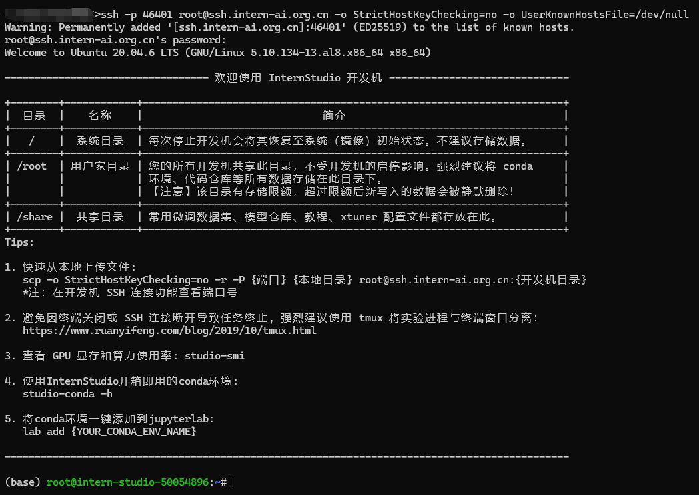
2. 使用 hostname 查看开发机名称
3. 使用 uname -a 查看内核信息
4. 使用 lsb_release -a 查看版本信息
5. 使用 nvidia-smi 查看 GPU 的信息
6. 输入两次 exit 退出远程连接

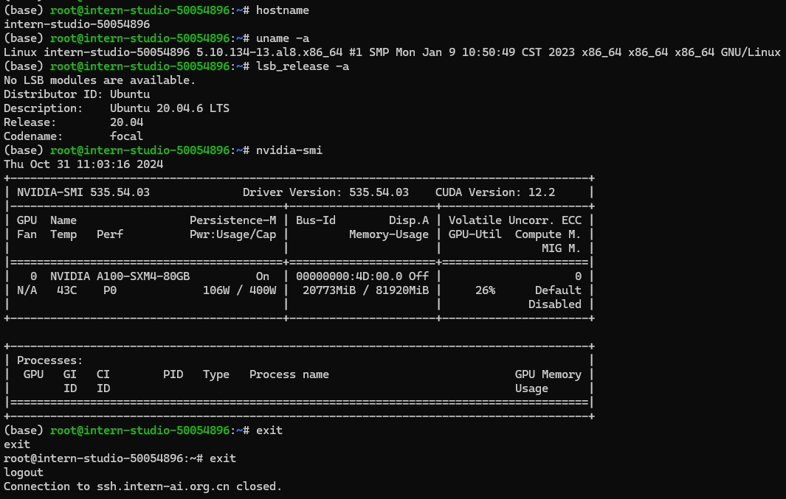

### 配置 SSH 密钥进行 SSH 远程连接
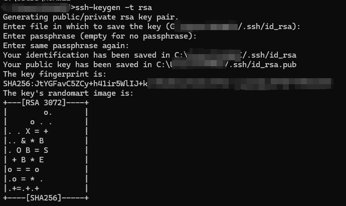

实现免密登录
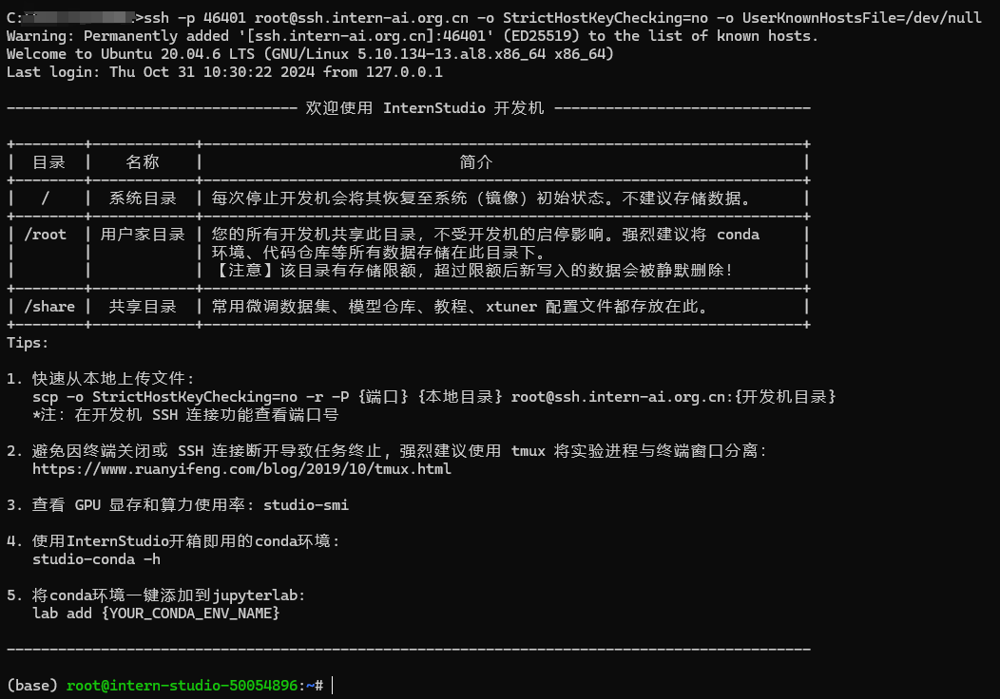

### 端口映射并运行 hello_world.py
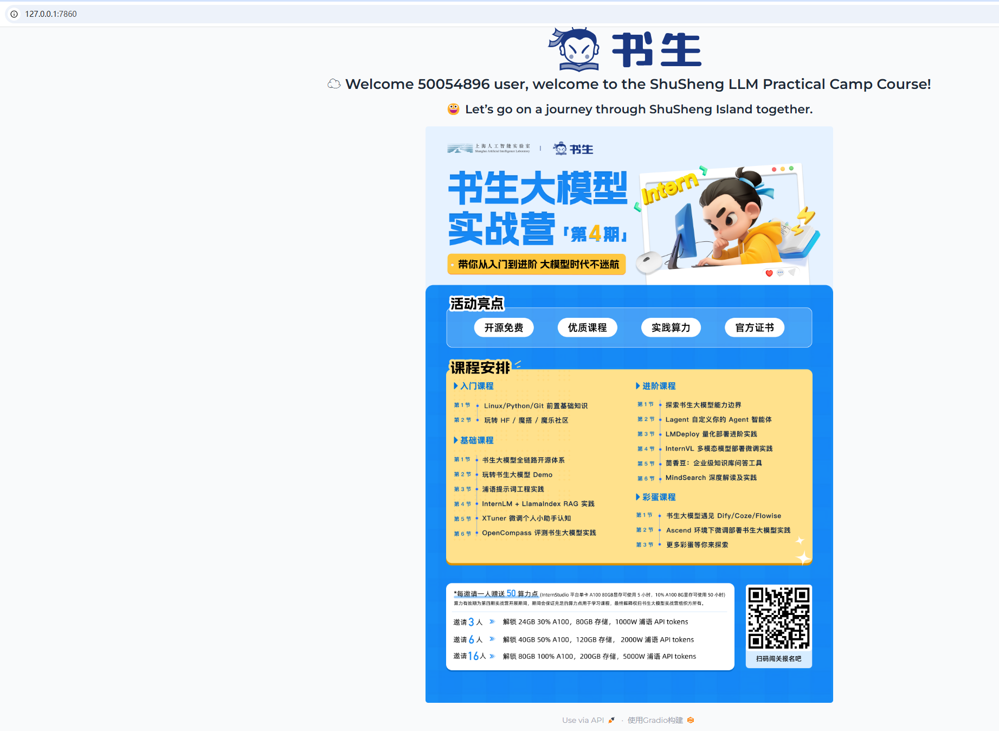

## Linux 基础命令
### 文件管理
1. 创建文件： touch 创建空文件
2. 创建目录： mkdir 
3. 目录切换： cd
4. 显示所在目录：pwd
5. 查看文件内容：
   1. 查看文件全部内容： cat 
   2. 分页查看： more 和 less
6. 编辑文件： vi 或 vim 
   1. 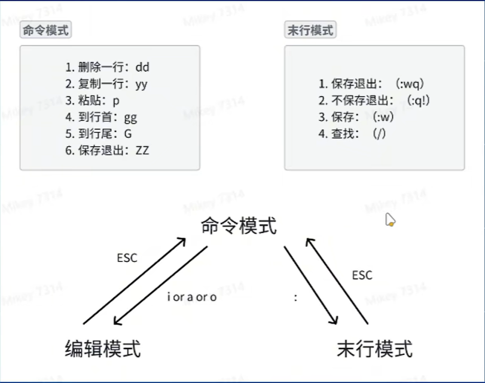
7. 复制文件： cp 
   1. 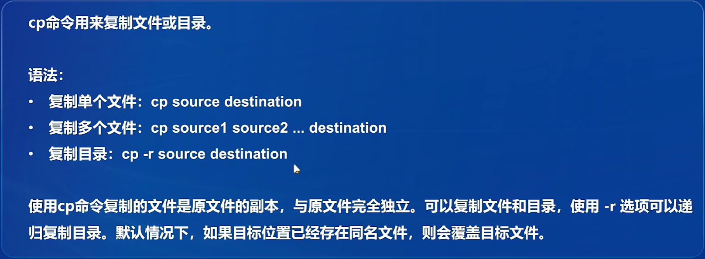
8. 创建文件链接：ln
   1. 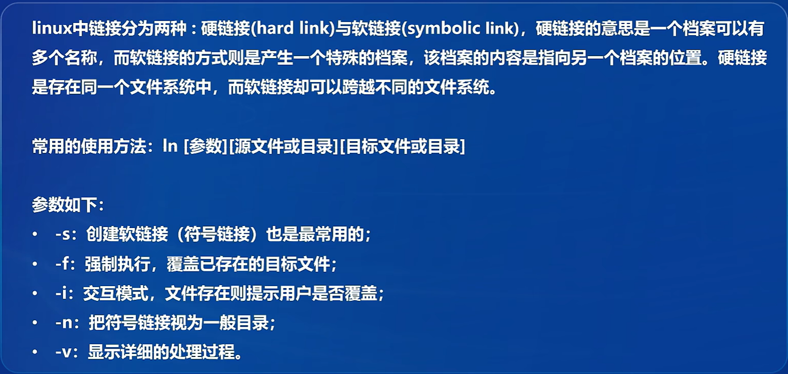
9. 移动文件：mv 
   1. 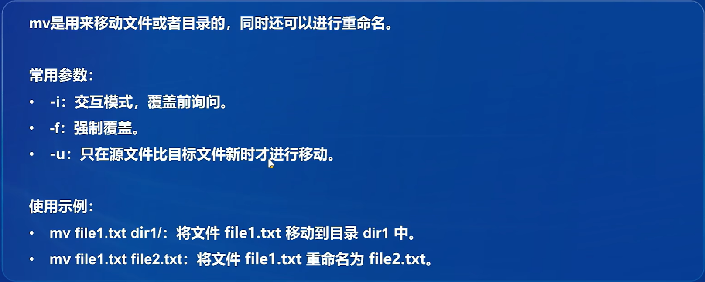
10. 删除文件： rm 
    1. 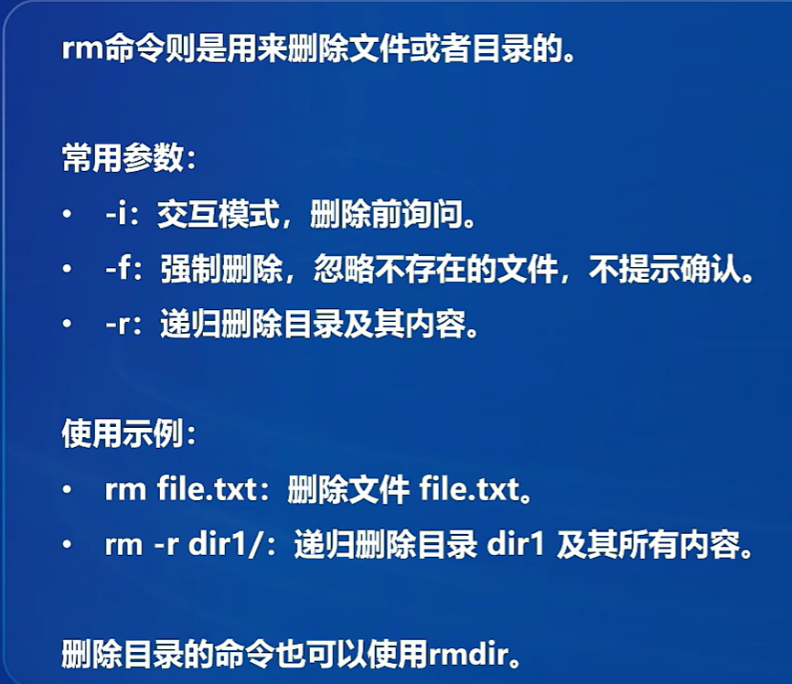
11. 删除目录：
    1. 只能删除空目录：rmdir
    2. 可删除非空目录：rm -r
12. 查找文件：find 
13. 查看文件或目录的详细信息：ls
    1. 查看目录下文件的详细信息：ls -l
14. 处理文件：
    1. 进行复杂的文件操作：sed
    2. 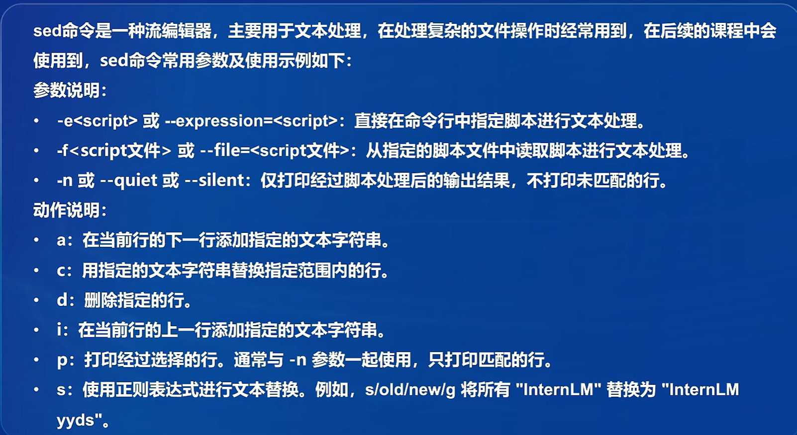
15. 文本搜素： grep

### 进程管理
1. 查看正在运行的进程： ps
2. 动态显示正在运行的进程：top
3. 树状查看正在运行的进程：pstree
4. 用于查找进程：pgrep
5. 更改进程的优先级：nice
   1. nice 值越低，进程优先级越高。
6. 显示进程的相关信息：jobs
7. 将进程调入后台：
   1. 将最近一个挂起的作业放到后台运行：bg 
   2. 将后台作业调到前台运行：fg
8. 杀死进程：kill
   1. kill 命令默认发送 SIGTERM 信号，如果进程没有响应，可以使用 -9 使用 SIGKILL 信号强制杀死进程
9. NVIDIA 系统管理接口（NVIDIA System Management Interface）的命令行工具：nvidia-smi
   1. 显示 GPU 状态的摘要信息：nvidia-smi
   2. 显示详细的 GPU 状态信息：
      1. 每 1 秒更新一次状态信息
      2. nvidia-smi -l 1
   3. 显示 GPU 的帮助信息：nvidia-smi -h
   4. 列出所有 GPU 并显示它们的 PID 和进程名称：nvidia-smi pmon
   5. 强制结束指定的 GPU 进程：
      1. 这会强制结束 GPU ID 为 0 上的 PID 为 12345 的进程
      2. nvidia-smi --id=0 --ex_pid=12345
   6. 设置 GPU 性能模式：
      1. 为所有 GPU 设置为性能模式：nvidia-smi -pm 1
      2. 只针对 ID 为 0 的 GPU 设置为性能模式：nvidia-smi -i 0 -pm 1
   7. 重启 GPU：
      1. 重启 ID 为 0 的 GPU：nvidia-smi --id=0 -r

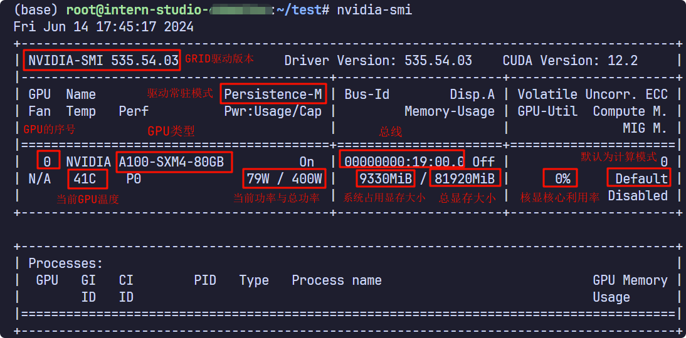

## conda
1. 激活：conda activate
2. 退出：conda deactivate
3. 获得环境中的所有配置：conda env export --name myenv > myenv.yml
4. 重新还原环境：conda env create -f  myenv.yml