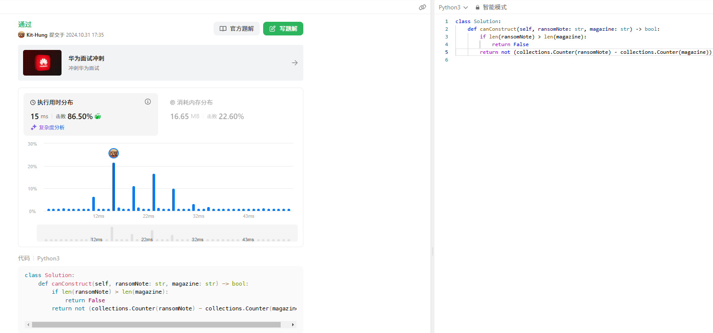
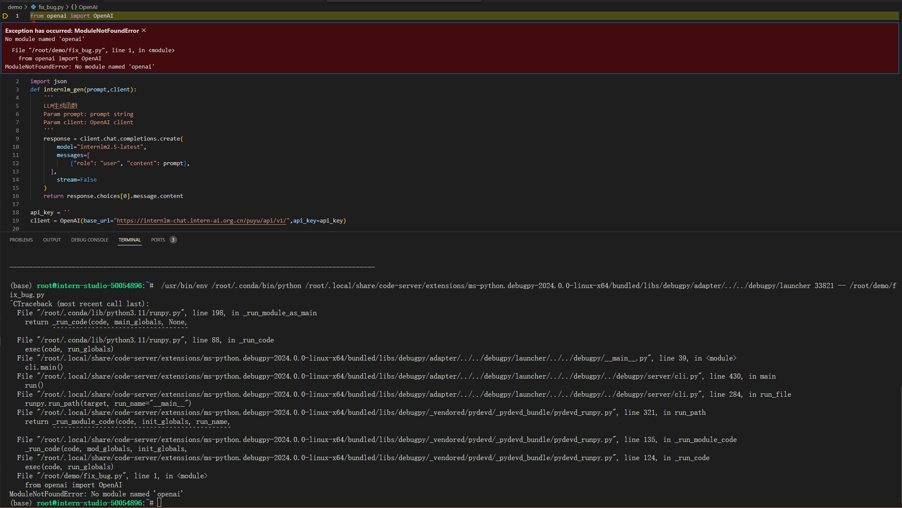
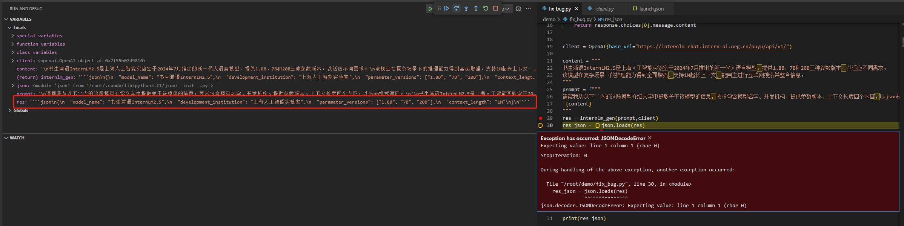
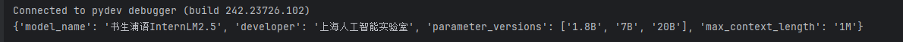

# Python 基础知识

## Conda 虚拟环境
```shell
# 创建新环境
conda create --name myenv python=3.9

# 激活环境
conda activate myenv

# 退出环境
conda deactivate

# 查看当前设备上所有的虚拟环境
conda env list

# 查看当前环境中安装了的所有包
conda list

# 删除环境（比如要删除 myenv）
conda env remove -n myenv
``` 


## Leetcode 383



## 修复 bug

### 运行报错，没有依赖



解决方案：
```shell
pip install openai
pip install debugpy
```


### 无法转换为 json


原因： res 只是个普通的字符串，不是 json 格式的字符串，无法转换

解决方案：去掉收尾多余的字符再转换
```python
res = res.strip('```json\n').strip('\n```')
```




## 安装 numpy 并引用
### 安装 numpy 到指定目录
```shell
pip install numpy --target /root/myenvs
```

### 代码中引用
```python
import sys

# 要添加的路径目录
dir_to_add = "/root/myenvs"

# 判断是否在 path 中，不在才添加
if dir_to_add not in sys.path:
    sys.path.append(dir_to_add)

# 导入模块
import numpy as np
vector_row = np.array([1,2])
print(vector_row[0])
```