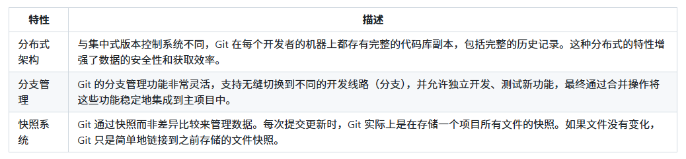
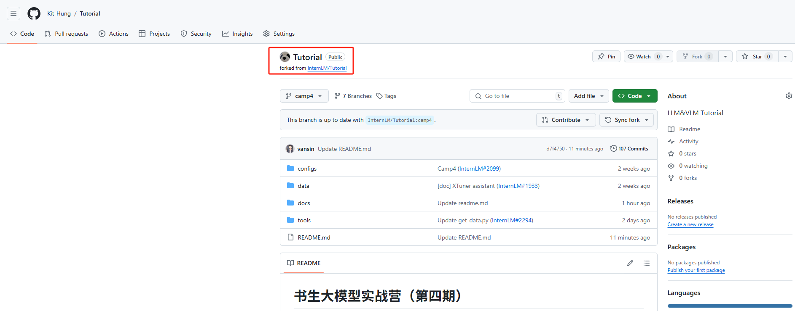

# Git 基础知识

## 基本概念
* 工作区（Working Directory）： 
  * 当我们在本地创建一个 Git 项目，或者从 GitHub 上 clone 代码到本地后，项目所在的这个目录就是“工作区”。
  * 这里是我们对项目文件进行编辑和使用的地方。
* 暂存区（Staging Area）： 
  * 暂存区是 Git 中独有的一个概念，位于 .git 目录中的一个索引文件，记录了下一次提交时将要存入仓库区的文件列表信息。
  * 使用 git add 指令可以将工作区的改动放入暂存区。
* 仓库区 / 本地仓库（Repository）： 
  * 在项目目录中，.git 隐藏目录不属于工作区，而是 Git 的版本仓库。
  * 这个仓库区包含了所有历史版本的完整信息，是 Git 项目的“本体”。


## 文件状态
* 在工作区的状态
  * 已跟踪：文件已被纳入版本控制，根据其是否被修改，可以进一步分为未修改（Unmodified）、已修改（Modified）或已暂存（Staged）。
  * 未跟踪：文件存在于工作目录中，但还没被纳入版本控制，也未处于暂存状态。


## 实现机制



## 安装
```shell

```


## 配置
```shell
# 全局配置
git config --global user.name "your_name"
git config --global user.email "your_email@example.com"

# 本地配置
git config --local user.name "your_name"
git config --local user.email "your_email@example.com"

# 查看全局配置
git config --global --list

# 查看仓库配置
git config --local --list

# 查看特定配置项
git config user.name
```


## 常用操作
```shell
# 将修改过的文件添加到本地暂存区
git add <文件名> 或 git add .

# 将暂存区中的更改提交到本地仓库
git commit -m '描述信息'

# 从远程仓库拉取最新的内容到本地仓库，并自动尝试合并到当前分支
git pull

# 将本地仓库的更改推送到远程仓库
git push
```


## fork 项目并提交自我介绍
### fork 项目到自己的账号下
  
  
  

  


### 创建新分支并提交自我介绍
```shell
# 克隆项目到本地
git clone https://github.com/Kit-Hung/Tutorial.git
cd Tutorial

# 查看分支列表
git branch -a

# 切换到 origin/class
git checkout -b class origin/class

# 创建新分支
git checkout -b class_3388

# 增加自我介绍
vim icamp4/3388.md

# 提交到暂存区
git add .

# 提交到本地仓库
git commit -m "add git_camp4_3388_introduction"

# 推送到远程仓库
git push origin class_3388
```


PR 地址：https://github.com/InternLM/Tutorial/pull/2367


## 构建个人笔记仓库
https://github.com/Kit-Hung/InternLM/tree/camp4
