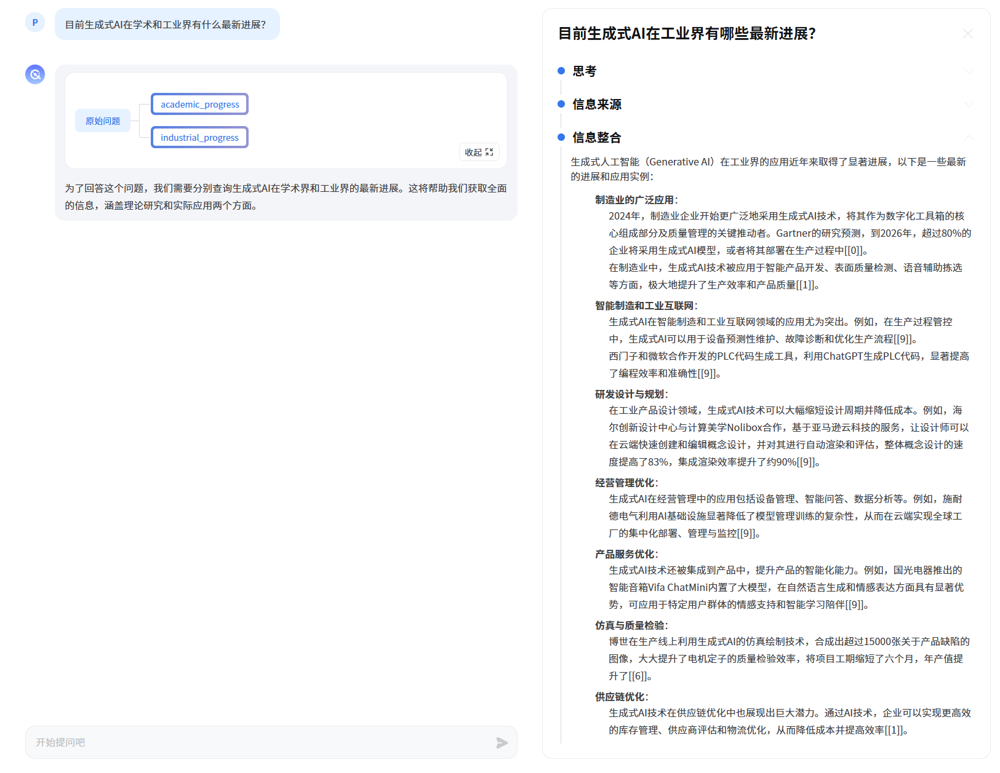
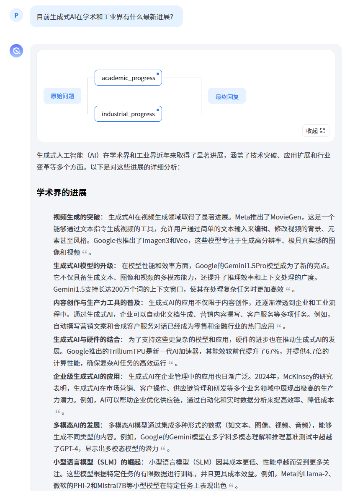
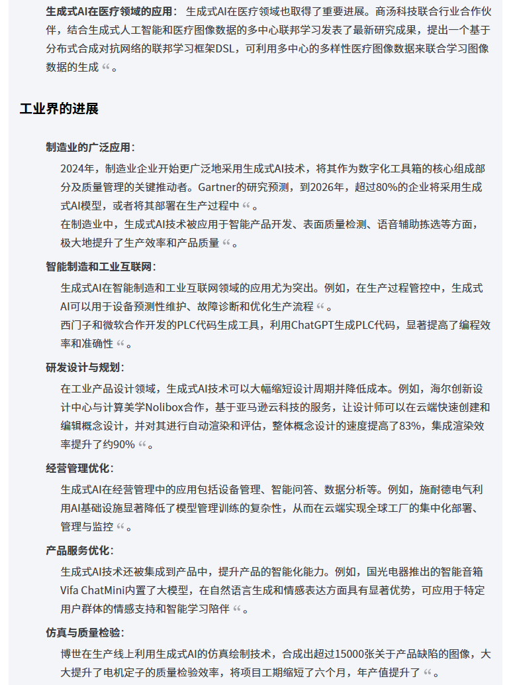
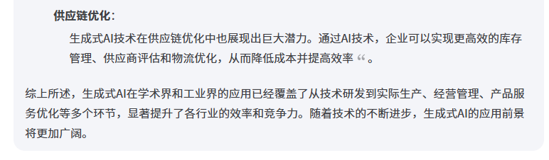
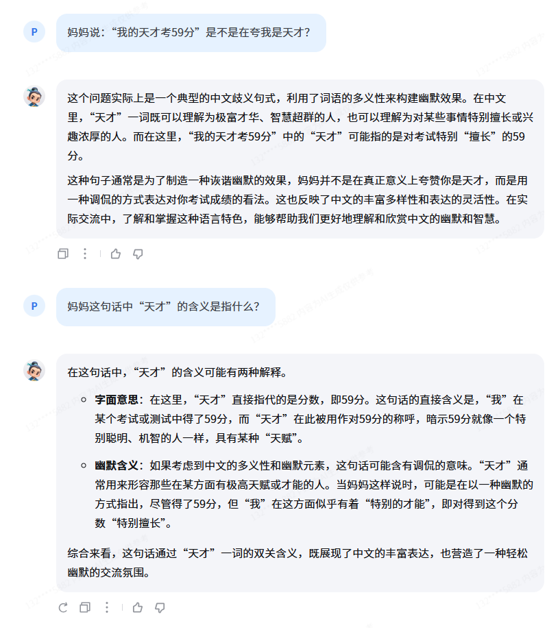
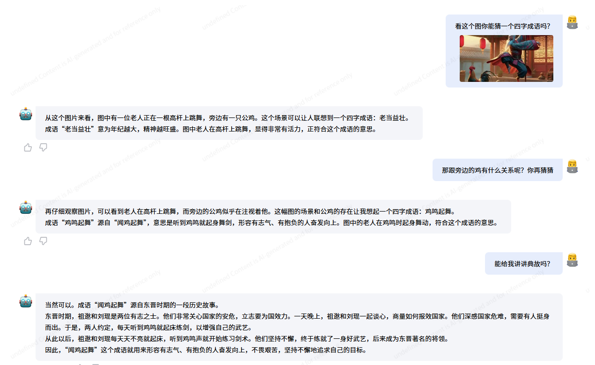
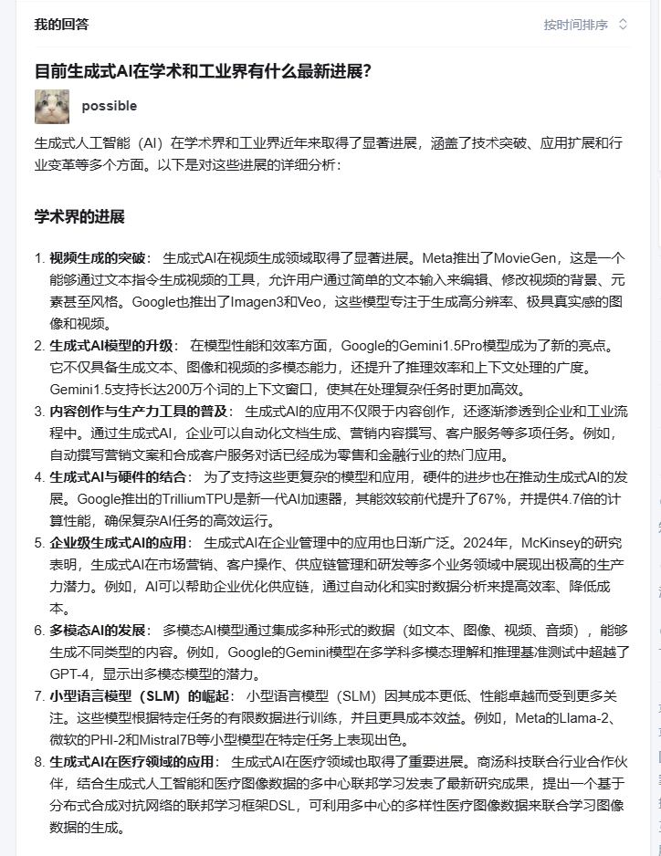

# 玩转书生「多模态对话」与「AI搜索」产品
## 书生·浦语
- 官网：https://internlm.intern-ai.org.cn
- 基于原生的 InternLM2.5 最新 Chat 模型 (InternLM2.5-20B) 搭建聊天机器人应用。
- 所有注册用户默认开放 3 百万 Tokens/月的 API 调用额度
- 有基础对话功能及智能体
- API 文档：https://internlm.intern-ai.org.cn/api/document

- 智能体
  - 文档助手
    - 可以上传文档让浦语帮忙去梳理文章结构、翻译文档、以及对论文中的一些关键贡献进行提问
  - MindSearch
    - 是一个开源的 AI 搜索引擎。
    - 它会对你提出的问题进行分析并拆解为数个子问题，在互联网上搜索、总结得到各个子问题的答案，最后通过模型总结得到最终答案。
    - 书生·浦语上的智能体为 MindSearch 的官方实现 (基于 InternLM2.5-20B) 具有与 Perplexity.ai Pro 相当的性能。
    - 具体步骤
      - 拆解问题
      - 解决子问题
      - 总结子节点结论

## MindSearch 开源的 AI 搜索引擎

## 书生·浦语 InternLM 开源模型官方的对话类产品

## 书生·万象 InternVL 开源的视觉语言模型官方的对话产品

## MindSearch 话题挑战

相关链接：https://www.zhihu.com/question/1841339763/answer/27173341252