# InternLM + LlamaIndex RAG 实践
## 书生·浦语开源一周年
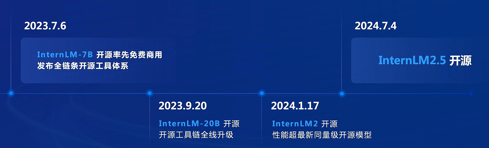


## RAG 
### 技术概述
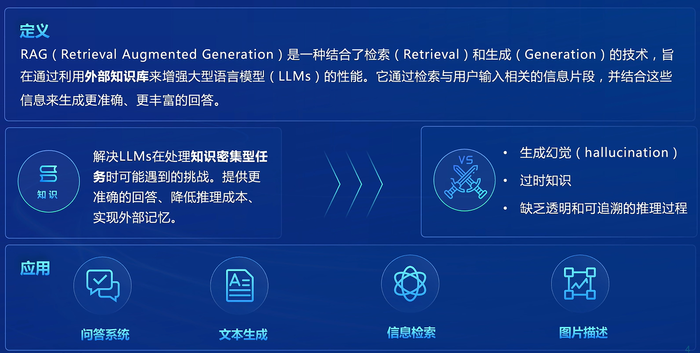

要解决的问题：
* 生成幻觉
* 过时知识
* 缺乏透明和可追溯的推理过程


### 给模型注入新知识的两种方式
1. 内部方式
   1. 即更新模型的权重
   2. 改变了模型的权重即进行模型训练，这是一件代价比较大的事情
   3. 相当于在编程中记住了某个函数的用法
2. 外部方式
   1. 给模型注入格外的上下文或者说外部信息，不改变它的的权重
   2. 相当于在编程中阅读函数文档然后短暂的记住了某个函数的用法
   3. 更容易实现
   4. RAG 正是这种方式
   5. 它能够让基础模型实现非参数知识更新，无需训练就可以掌握新领域的知识


### 工作原理
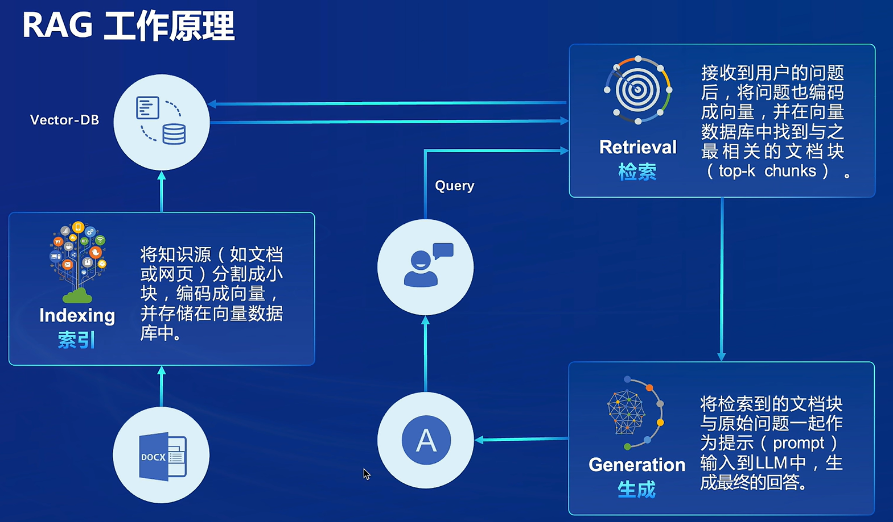


### 向量数据库 ( Vector-DB )
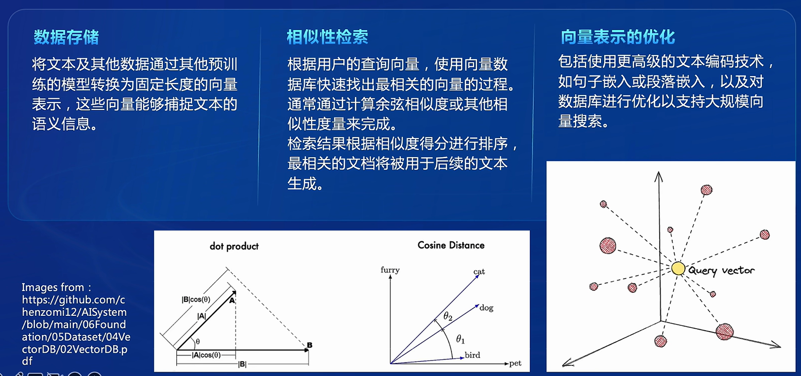


### RAG 发展进程
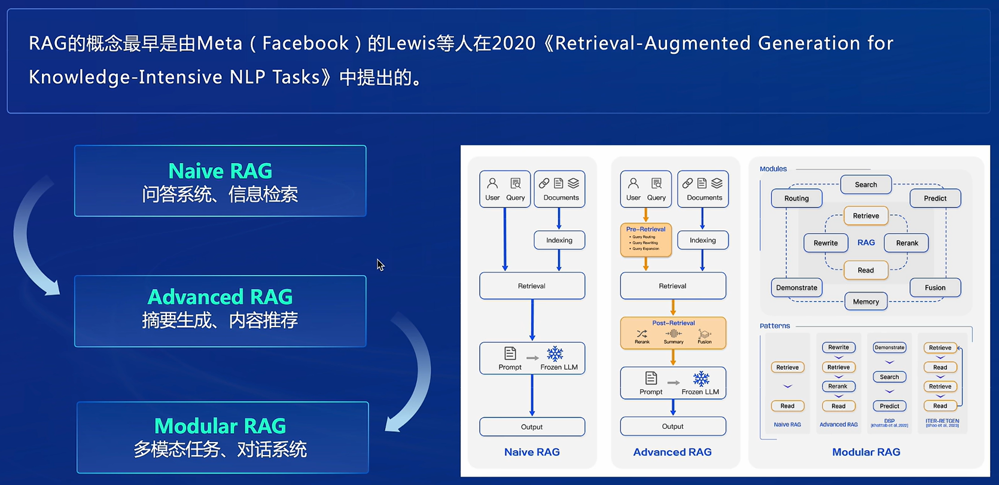


### RAG 常见优化方法
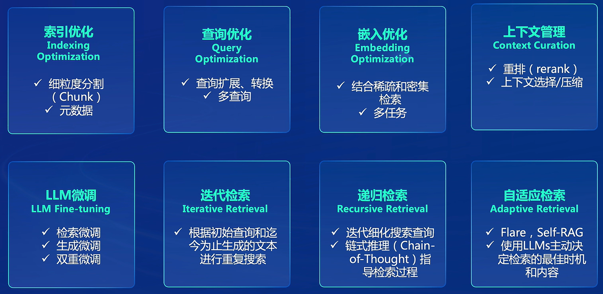


### RAG vs.微调( Fine-tuning )
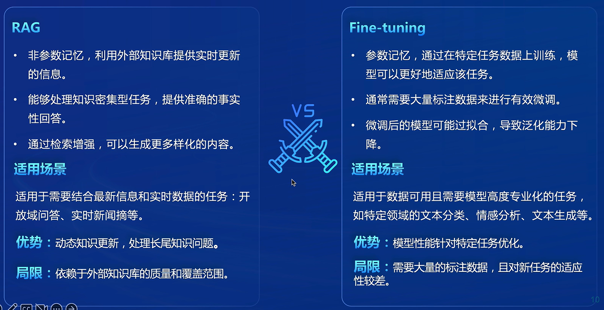


### LLM 模型优化方法比较
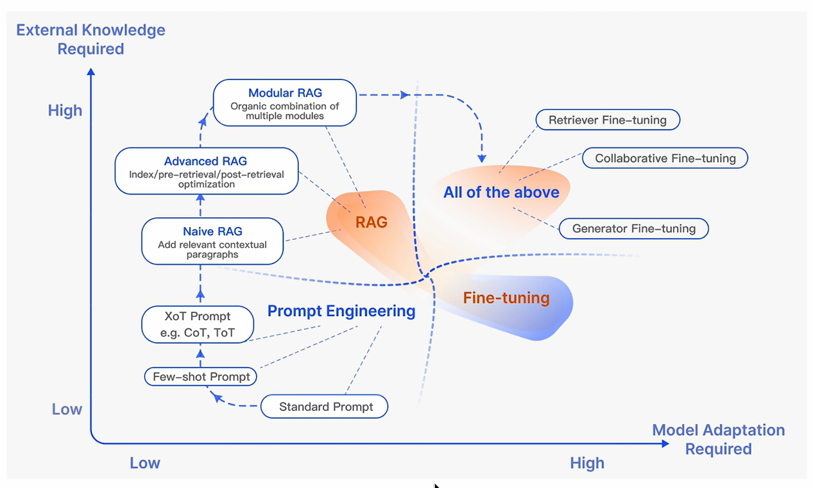

* Fine-tuning 对模型适配度很高，但实时性相对较差
* Prompt Engineering 是一种比较初级的方式，模型适配度一般，实时性也一般
* RAG 对实时性提升很好，模型适配没 Fine-tuning 那么强


### 评估框架和基准测试
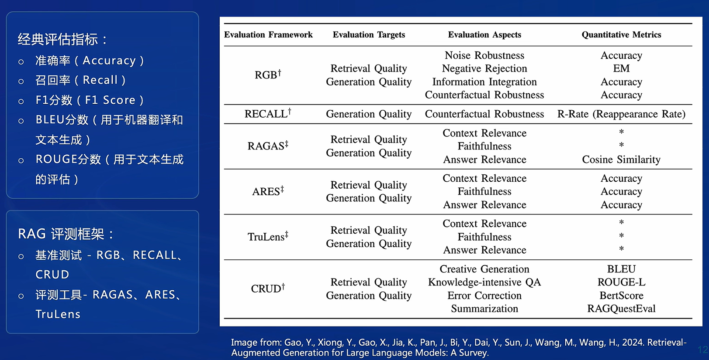


### RAG 总结
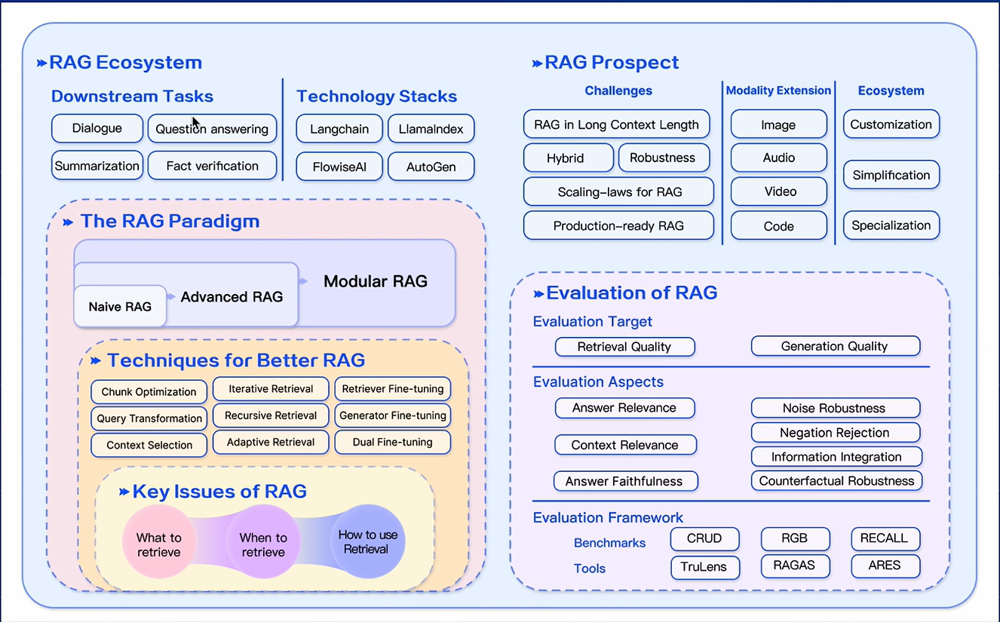


## LlamaIndex
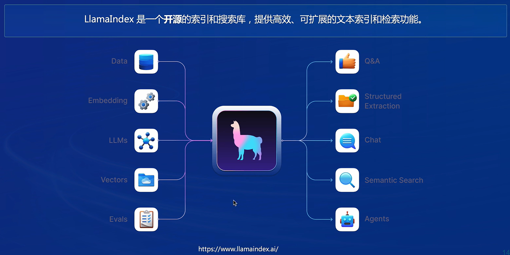

* LlamaIndex 是一个上下文增强的 LLM 框架，旨在通过将其与特定上下文数据集集成，增强大型语言模型（LLMs）的能力。
* 它允许您构建应用程序，既利用 LLMs 的优势，又融入您的私有或领域特定信息。


### LlamaIndex 特点
* 数据索引和检索
  * 对大规模数据进行索引，支持多种数据源(文件、数据库、网络等 )。
  * 提供高效的检索机制，快速找到相关信息。
* 支持多种生成模型
  * 除 Llama 系列外,还支持 GPT 系列、OpenAI API、和 InternLM 系列等多种大模型

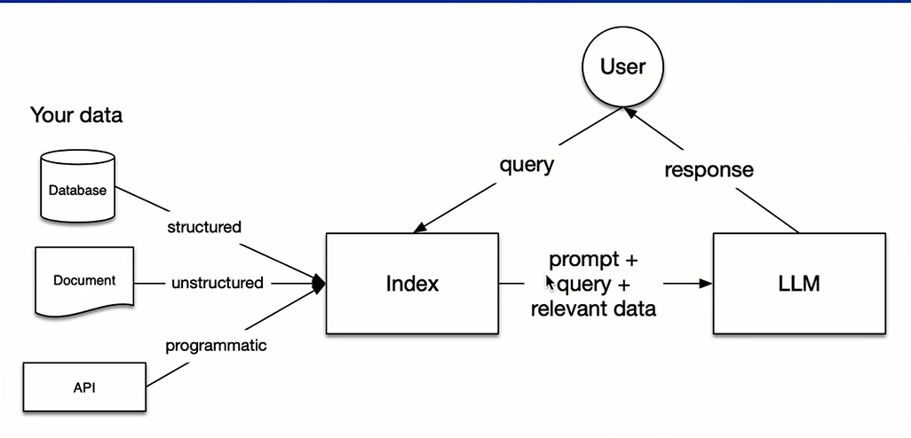


### LlamaIndex RAG 应用
* Llamalndex 提供了 RAG 一般应用的全过程模块化，拓展方便
* 数据加载( Loading )
  * 从多种数据源加载数据: 
    * 无论是文本文件、PDF、网站、数据库还是API, Llamalndex 通过 LlamaHub 提供了数百个连接器( connectors or Reader)，使数据加载过程高效且多样化
* 数据索引( Indexing )
  * 创建数据结构: 
    * LamaIndex 通过创建向量嵌入 vector embeddings (数据含义的数值表示)和其他元数据策略来索引数据。
    * 这些结构使得査询数据变得简单且精确，能够快速找到上下文相关的信息。
* 数据存储( Storing ) 
  * 索引和元数据存储: 
    * 一旦数据被索引, Llamaindex 会将索引和其他元数据存储起来，避免重复索引过程。
    * 这种方法提高了系统的效率和响应速度
* 数据查询( Querying )
    * 多样化的查询策略:
      * 对于任何给定的索引策略，LlamaIndex 提供了多种査询方式,包括子査询、多步骤査询和混合策略
      * 这些方法利用 LLM 和 LlamaIndex 数据结构，确保能够准确且有效地获取所需信息。
* 效果评估( Evaluating )
    * 评估和优化:
      * 在任何管道中，评估是关键步骤。
      * LlamaIndex 提供客观的评估方法，衡量查询响应的准确性、忠实性和速度。
      * 通过评估，用户可以比较不同策略的效果，并在进行更改时确保系统性能的稳定和优化


## 【任务 1 】是否使用 LlamaIndex 前后对比
### 不使用 LlamaIndex RAG（仅 API ）
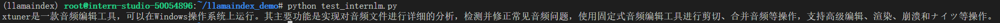


### 使用 API + LlamaIndex
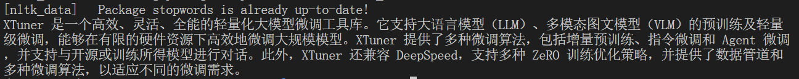


### LlamaIndex web
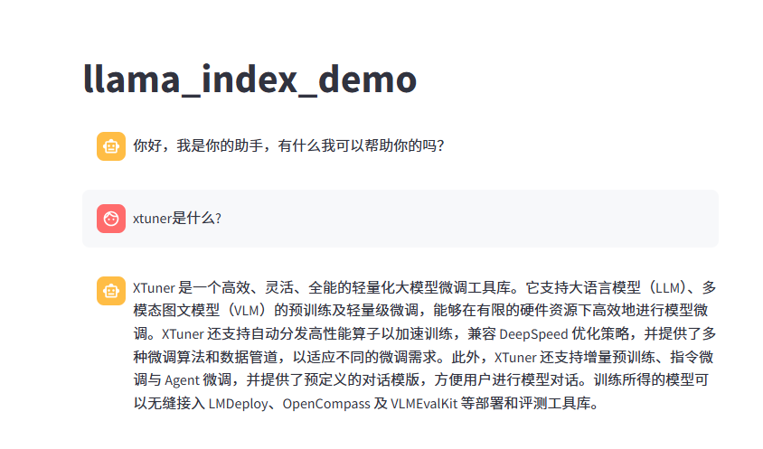


## 【任务 2 】 InternLM2-Chat-1.8B 是否使用 LlamaIndex 前后对比
### 不使用 LlamaIndex RAG（仅 API ）
```python
from llama_index.llms.huggingface import HuggingFaceLLM
from llama_index.core.llms import ChatMessage
llm = HuggingFaceLLM(
    model_name="/root/model/internlm2-chat-1_8b",
    tokenizer_name="/root/model/internlm2-chat-1_8b",
    model_kwargs={"trust_remote_code":True},
    tokenizer_kwargs={"trust_remote_code":True}
)

rsp = llm.chat(messages=[ChatMessage(content="xtuner是什么？")])
print(rsp)
```

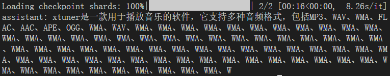


### ### 使用 API + LlamaIndex
```python

from llama_index.core import VectorStoreIndex, SimpleDirectoryReader, Settings

from llama_index.embeddings.huggingface import HuggingFaceEmbedding
from llama_index.llms.huggingface import HuggingFaceLLM

#初始化一个HuggingFaceEmbedding对象，用于将文本转换为向量表示
embed_model = HuggingFaceEmbedding(
#指定了一个预训练的sentence-transformer模型的路径
    model_name="/root/model/sentence-transformer"
)
#将创建的嵌入模型赋值给全局设置的embed_model属性，
#这样在后续的索引构建过程中就会使用这个模型。
Settings.embed_model = embed_model

llm = HuggingFaceLLM(
    model_name="/root/model/internlm2-chat-1_8b",
    tokenizer_name="/root/model/internlm2-chat-1_8b",
    model_kwargs={"trust_remote_code":True},
    tokenizer_kwargs={"trust_remote_code":True}
)
#设置全局的llm属性，这样在索引查询时会使用这个模型。
Settings.llm = llm

#从指定目录读取所有文档，并加载数据到内存中
documents = SimpleDirectoryReader("/root/llamaindex_demo/data").load_data()
#创建一个VectorStoreIndex，并使用之前加载的文档来构建索引。
# 此索引将文档转换为向量，并存储这些向量以便于快速检索。
index = VectorStoreIndex.from_documents(documents)
# 创建一个查询引擎，这个引擎可以接收查询并返回相关文档的响应。
query_engine = index.as_query_engine()
response = query_engine.query("xtuner是什么?")

print(response)
```

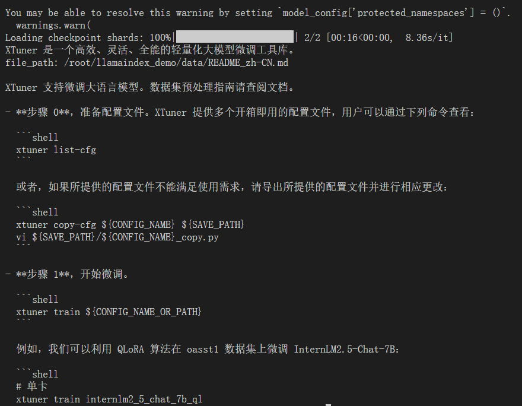


## 【任务 3】 将 Streamlit + LlamaIndex + 浦语 API 的 Space 部署到 Hugging Face
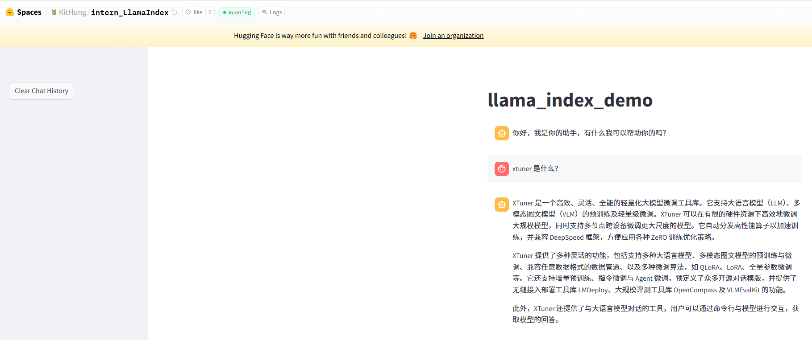

相关链接：https://huggingface.co/spaces/KitHung/intern_LlamaIndex