# XTuner 微调个人小助手认知
## 微调
* 大语言模型微调 (Fine-tuning of Large Language Models)是指在预训练的大型语言模型基础上，使用特定任务的数据进一步训练模型，以使其更好地适应和执行特定任务的过程。

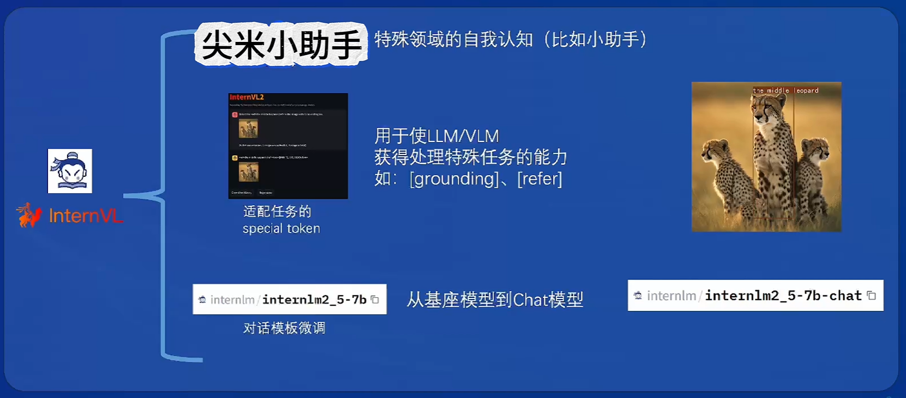


### 适用场景
* 显卡有限
* 数据有限


### 两种 Finetune 范式
* LLM 的下游应用中，增量预训练和指令跟随是经常会用到两种的微调模式
* 增量预训练微调
  * 使用场景: 让基座模型学习到些新知识，如某个垂类领域的常识
  * 训练数据: 文章、书籍、代码等
* 指令跟随微调
  * 使用场景: 让模型学会对话模板，根据人类指令进行对话
  * 训练数据: 高质量的对话、问答数据


### LoRA & QLoRA
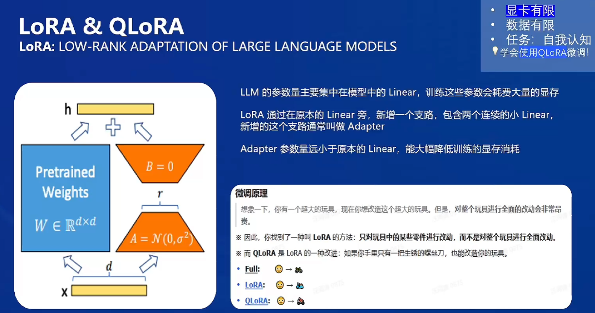

* LLM 的参数量主要集中在模型中的 Linear，训练这些参数会耗费大量的显存
* LoRA 通过在原本的 Linear 旁，新增一个支路，包含两个连续的小 Linear，新增的这个支路通常叫做 Adapter
* Adapter 参数量远小于原本的 Linear，能大幅降低训练的显存消耗

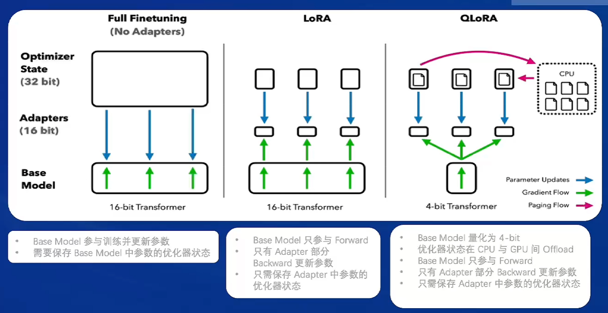


## 全链条开源开放体系 | 微调 XTuner
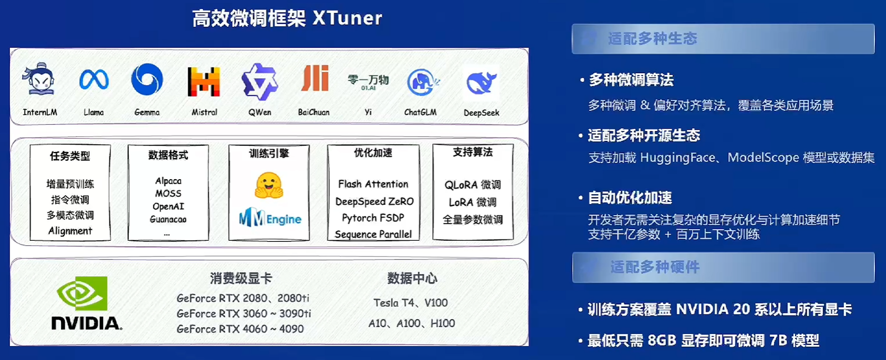

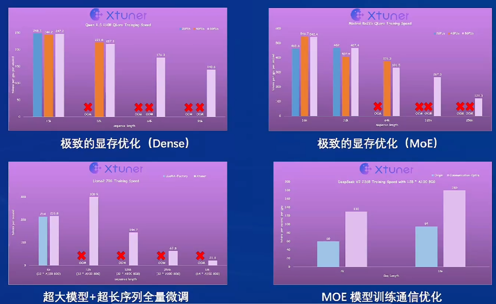

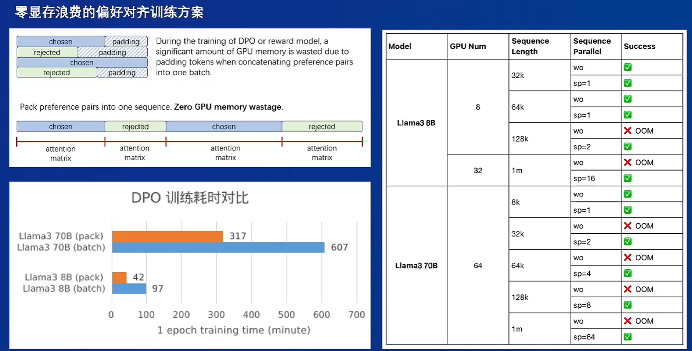


### config 参数
* 模型设置
  * pretrained_model_name_or_path: 预训练模型的路径，这里使用的是 InternLM2 5-7B 聊天模型。
  * use_varlen_attn: 是否使用可变长度注意力，这里设置为 False。
* 数据设置:
  * data_path: 训练数据的路径
  * prompt_template: 使用 InternLM2 聊天的提示模板。
  * max_length: 最大序列长度，设置为 2048 个 token
  * pack_to_max_length: 是否将数据打包到最大长度，设为 True 以提高效率。
* 并行设置
  * sequence_parallel_size: 序列并行的大小这里设为 1，表示不使用序列并行。


### 通过调什么来提升我的模型
* 调度器和优化器设置 
  * batch_size: 每个设备的批量大小，设为 1 。
  * accumulative_counts: 梯度累积次数，这里实际上是 1 。
  * dataloader_num_workers: 数据加载器的工作进程数，设为 0 表示不使用多进程加载。
  * max_epochs: 最大训练轮数，设为 3 轮。
  * optim_type: 优化器类型，使用Adamw
  * lr: 学习率，设为 2e-4。
  * betas: Adamw 优化器的 beta 参数
  * weight_decay: 权重衰减，设为 0 表示不使用
  * max_norm: 梯度裁剪的最大范数，设为 1 
  * warmup_ratio: 预热比例，设为 0.03，即 3% 的训练时间用于预热。
* 保存设置:
  * save_steps: 每 500 步保存一次检查点
  * save_total_limit: 最多保存 2 个检查点
* 评估设置:
  * evaluation_freq: 每 100 步进行一次生成性能评估。
  * SYSTEM: 使用 Alpaca 的系统模板
  * evaluation_inputs: 用于评估的输入问题列表，主要是关于模型身份的问题

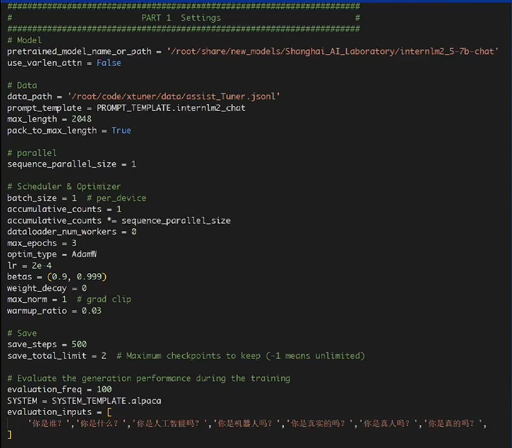

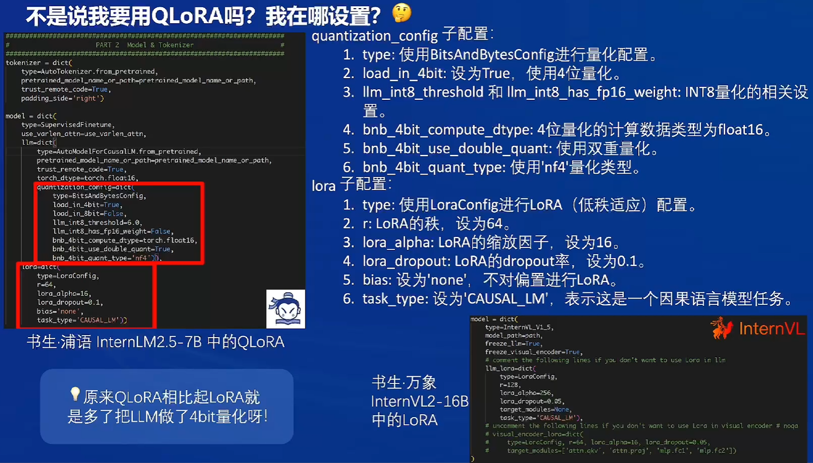


### 数据从哪里来
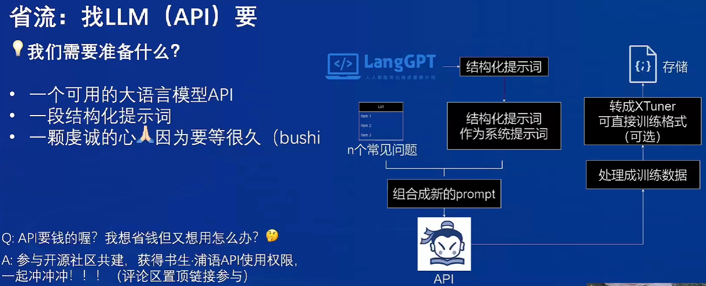


### 对话模板
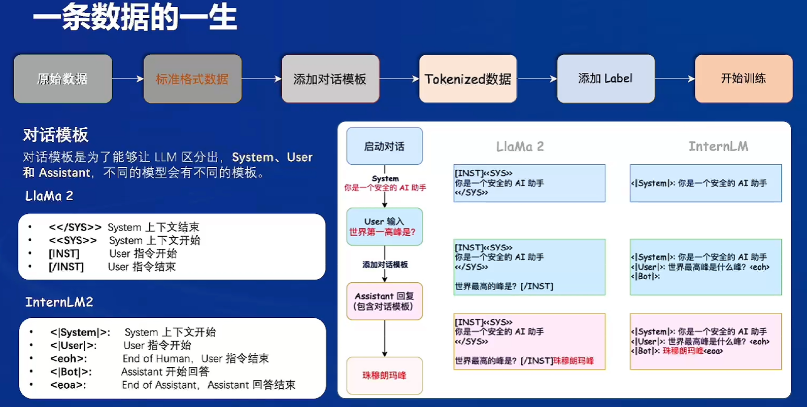


## 微调
文档链接： https://github.com/InternLM/Tutorial/blob/camp4/docs/L1/XTuner/README.md

### 环境配置与数据准备
1. 使用 conda 先构建一个 Python-3.10 的虚拟环境
2. 安装 XTuner
3. 验证安装


### 修改提供的数据
1. 创建一个新的文件夹用于存储微调数据
2. 创建修改脚本
3. 执行脚本
   ```shell
    # usage：python change_script.py {input_file.jsonl} {output_file.jsonl}
    cd ~/finetune/data
    python change_script.py ./assistant_Tuner.jsonl ./assistant_Tuner_change.jsonl
    ```
4. 查看数据
    ```shell
   cat assistant_Tuner_change.jsonl | head -n 3
   ```

### 训练启动
1. 复制模型
2. 修改 Config
3. 启动微调
   ```shell
    cd /root/finetune
    conda activate xtuner-env
    
    xtuner train ./config/internlm2_5_chat_7b_qlora_alpaca_e3_copy.py --deepspeed deepspeed_zero2 --work-dir ./work_dirs/assistTuner
    ```
4. 权重转换
   ```shell
    cd /root/finetune/work_dirs/assistTuner
    
    conda activate xtuner-env
    
    # 先获取最后保存的一个pth文件
    pth_file=`ls -t /root/finetune/work_dirs/assistTuner/*.pth | head -n 1 | sed 's/:$//'`
    export MKL_SERVICE_FORCE_INTEL=1
    export MKL_THREADING_LAYER=GNU
    xtuner convert pth_to_hf ./internlm2_5_chat_7b_qlora_alpaca_e3_copy.py ${pth_file} ./hf
    ```
5. 模型合并
   ```shell
    cd /root/finetune/work_dirs/assistTuner
    conda activate xtuner-env
    
    export MKL_SERVICE_FORCE_INTEL=1
    export MKL_THREADING_LAYER=GNU
    xtuner convert merge /root/finetune/models/internlm2_5-7b-chat ./hf ./merged --max-shard-size 2GB
    ```
   

## 模型 WebUI 对话
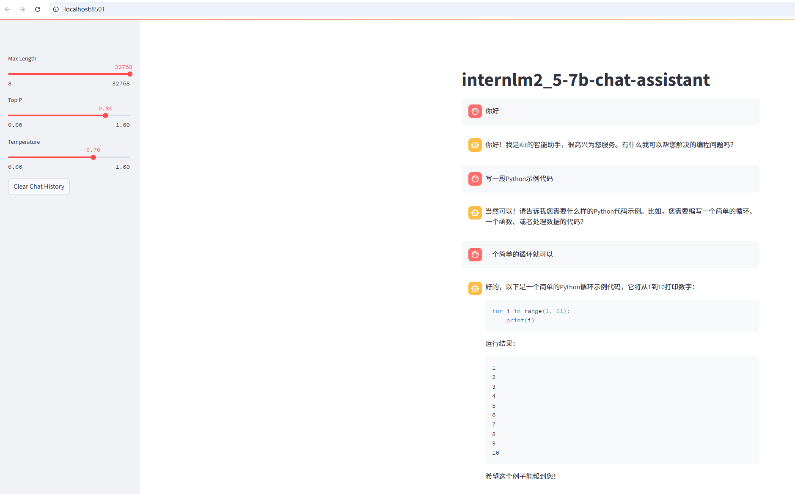


## 将自我认知的模型上传到 HuggingFace
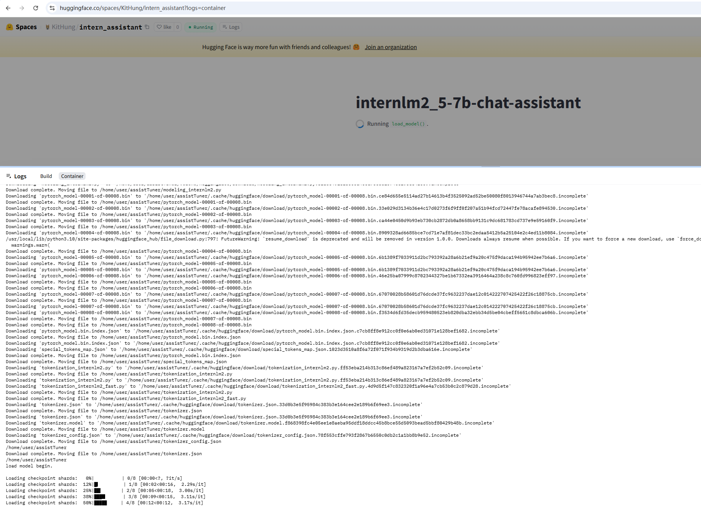

备注：由于硬件资费及资源问题模型加载一直卡在 50% 就没法继续加载了，但是代码和模型没啥问题的

space 链接： https://huggingface.co/spaces/KitHung/intern_assistant

模型链接： https://huggingface.co/KitHung/intern_assistant