# OpenCompass 评测书生大模型实践
## 大模型评测
### 评测重要性和挑战
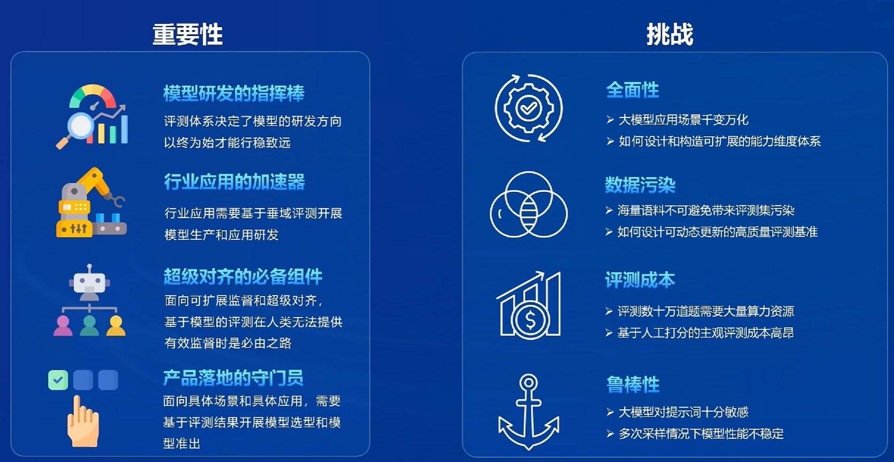


### 如何评测
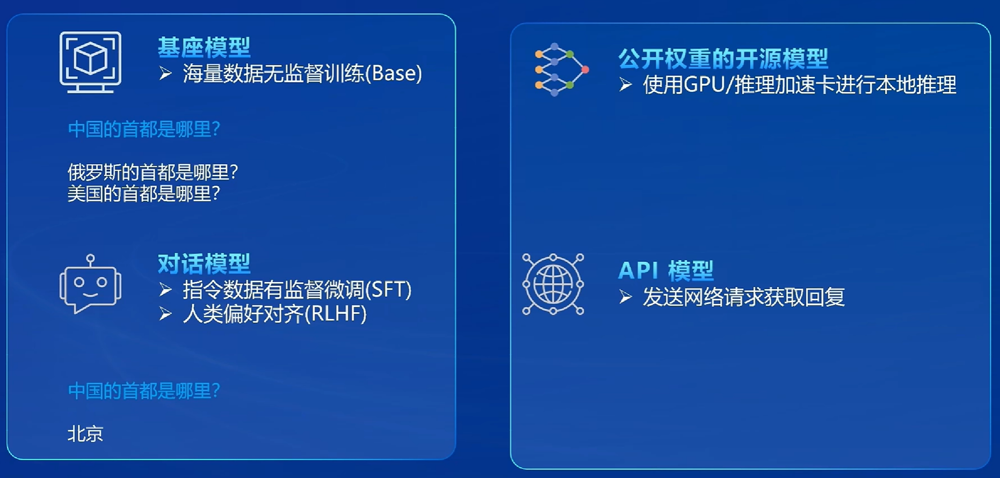


### 客观评测与主观评测
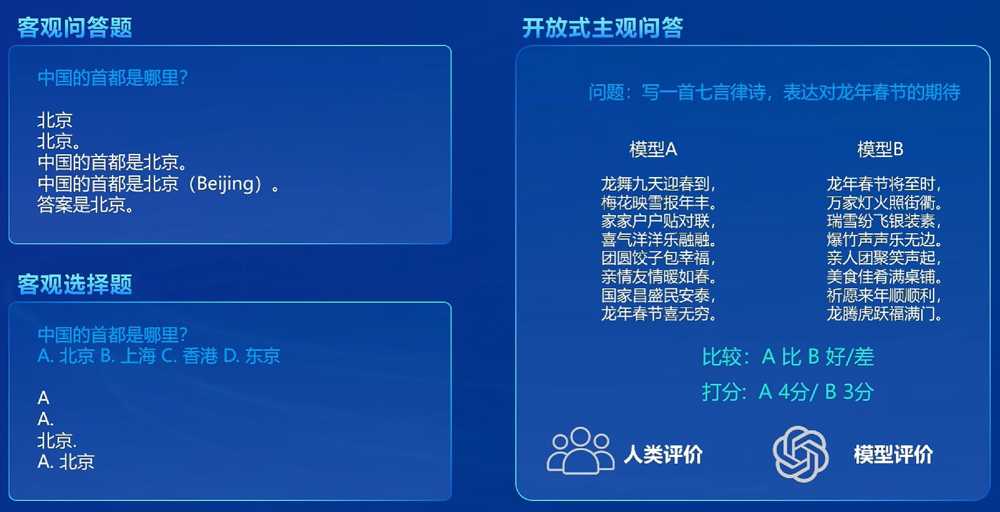

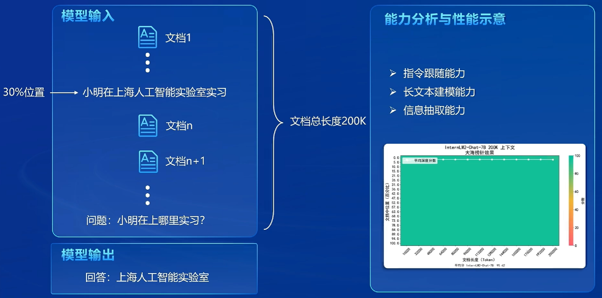


* 客观评测
  * 客观问答题
  * 客观选择题
* 主观评测
  * 开放式问答
    * 人类评价
    * 模型评价（更多考虑这种）
* 长文本评测


### OpenCompass 2.0 司南大模型评测体系开源历程
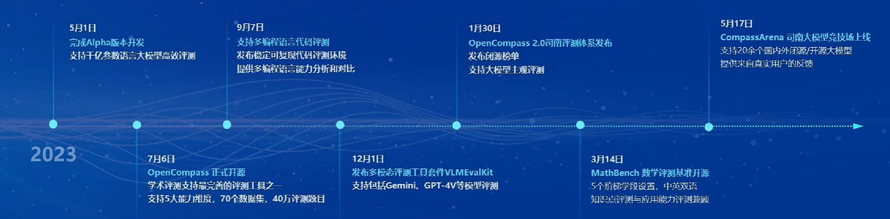


### OpenCompass 助力大模型产业发展和学术研究
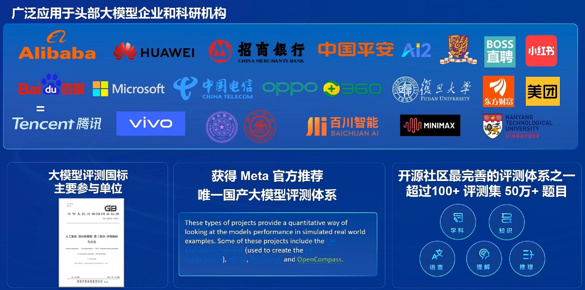

* 大模型评测国标主要参与单位
* 获得 Meta 官方推荐唯一国产大模型评测体系
* 开源社区最完善的评测体系之一超过 100+ 评测集 50万+ 题目


## 司南生态
### 汇集社区力量: 工具 - 基准 - 榜单 三位一体
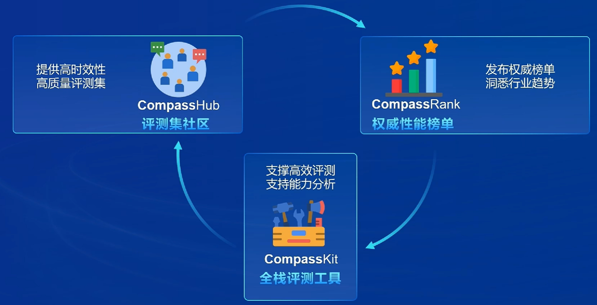


### CompassRank: 中立全面的性能榜单
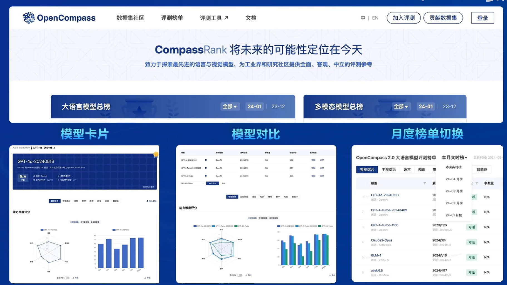


### CompassKit: 大模型评测全栈工具链
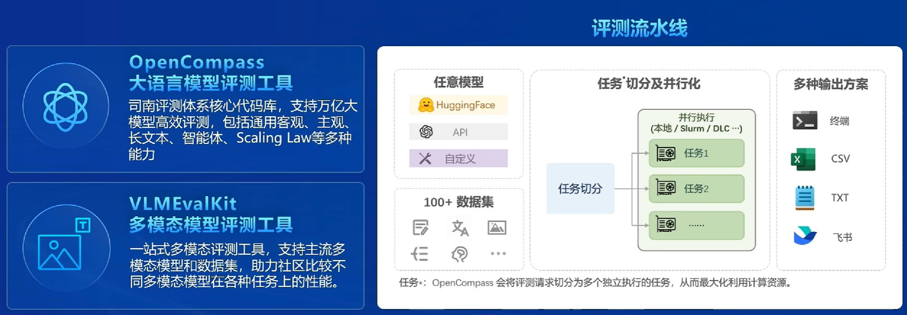


### CompassHub: 高质量评测基准社区
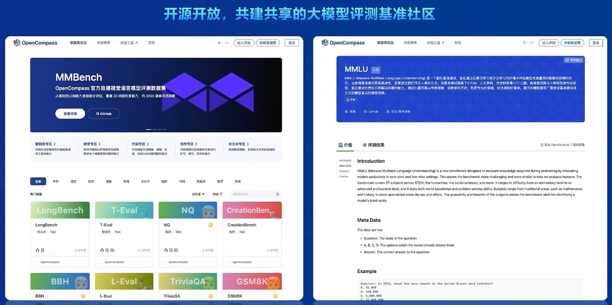


## CompassBench 模型能力洞察
### 闭源评测集简介
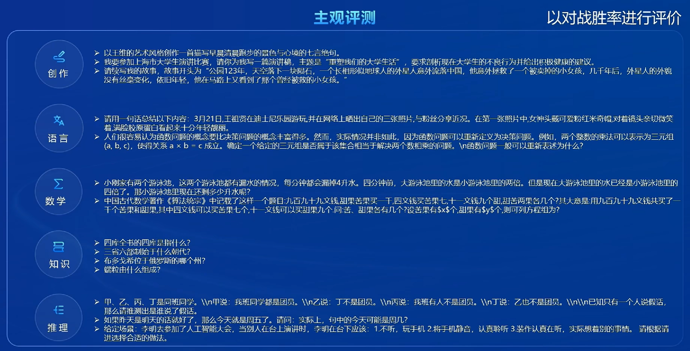

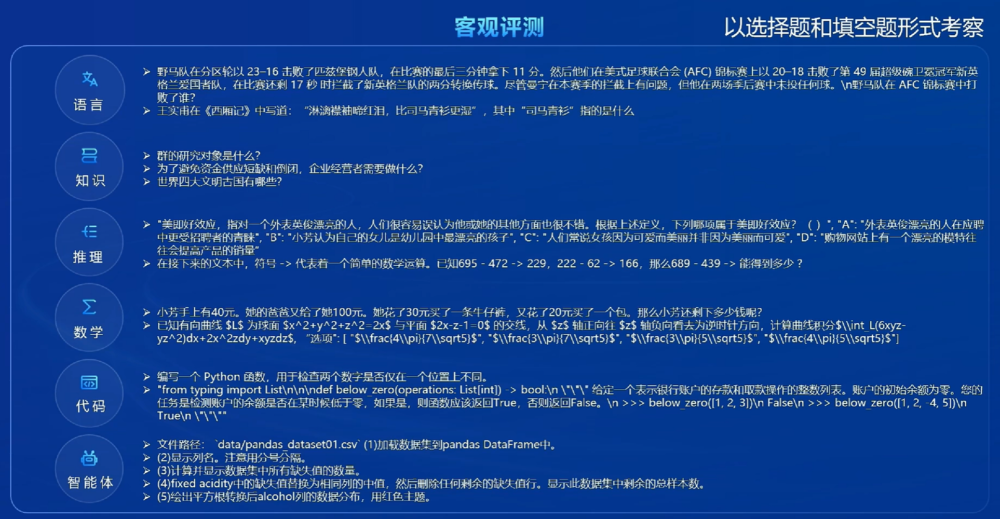

* 主观评测
  * 以对战胜率进行评价
* 客观评测
  * 以选择题和填空题形式考察


### 性能趋势
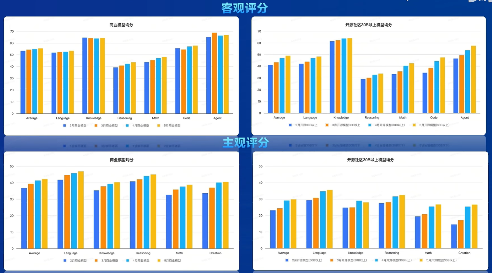


### 司南评测模型性能分析
* 整体能力仍有较大提升空间
  * OpenCompass 采用了更加准确的循环评测策略对大模型能力进行分析。
* 在百分制的客观评测基准中 GPT-4o-20240513 也仅仅达到了 64 分的及格水平。
* 闭源大模型接近 GPT-4 水平
  * 近期发布的国产商业模型表现优异，多个维度上缩小了与 GPT-4 的差距
* 国内模型在中文场景具有性能优势
  * 在中文语言理解、中文知识和中文创作上，国内商业模型相比 GPT-4 具有极强的竞争力，甚至部分模型实现了单个维度上对 GPT-4 的超越。
* 开源社区未来可期
  * Lama3、Qwen1.5、Yi1.5、InterLM2 等等开源模型，展示出优秀的综合性对话体验，并接近商业闭源模型的性能,
* 复杂推理仍是短板
  * 国内多个模型综合能力和 GPT-4 在接近，但在复杂推理上仍然存在较大差距，并且和模型尺寸存在较强相关性。


### 发展趋势分析
* 模型尺寸逐渐收敛，大小模型并重
  * 面向端侧打造高推理速度、特定场景性能优异的 2B 参数以下的小模型
  * 云端服务集中以 70B - 100B 为主，具有性能与推理成本的较好平衡
  * 头部模型玩家的核心技术竞争集中千亿大模型，面向 AGI 持续探索涌现能力
* 稠密模型和 MoE 之争仍需探索
  * 模型宏观架构的路线探索尚未收敛
  * 稠密模型具有较好的推理效率，MoE 模型具有更强的性能潜力
* 长文本能力日益重要，基础结构多路线并行
  * 各类复杂应用场景对模型的长文本能力有较高要求
  * 高效注意力机制和 RNN 类模型，在超长文本建模上仍有发展潜力
* 复杂推理和智能体应用仍需技术突破
  * 现有的模型在多步复杂推理和各类交互式智能体应用中还有较大性能提升空间
  * 模型架构、合成数据策略、智能体系统设计等仍有大量技术难点亟需攻关
* 基于模型的评价将成为主流
  * 在专业知识领域，普通人类标注员的准确率可能相比先进大模型并无显著优势
  * 随着大模型能力的不断增强，使用模型对待测模型进行性能评估逐渐成为可能


## 司南榜单矩阵
### 大模型评测体系
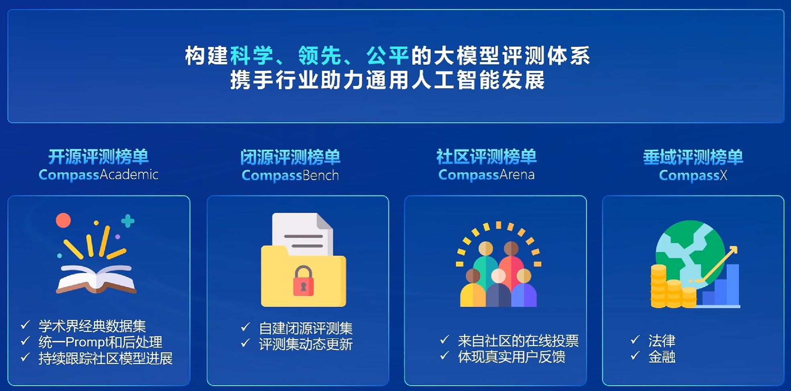

* 开源评测榜单 CompassAcademic
* 闭源评测榜单 CompassBench
* 社区评测榜单 CompassArena
* 垂域评测榜单 CompassX


### CompassAcademic 基准选择策略
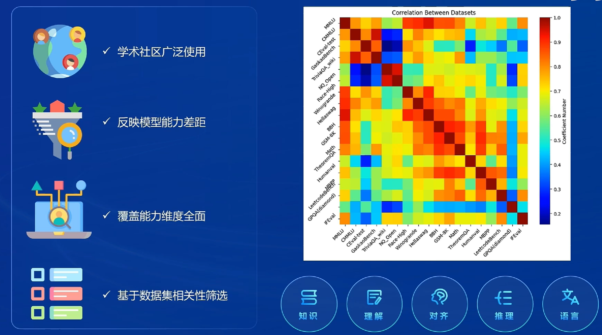

* 学术社区广泛使用
* 反映模型能力差距
* 覆盖能力维度全面
* 基于数据集相关性筛选


### CompassBench 闭源评测介绍
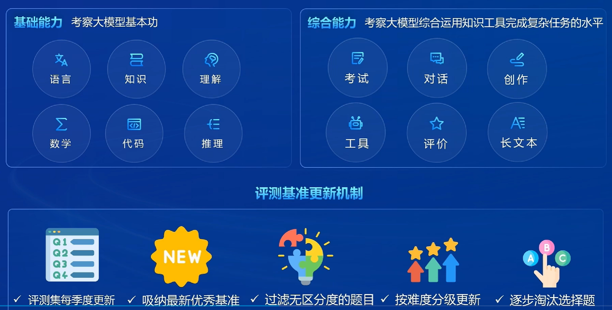


### CompassArena 大模型竞技场
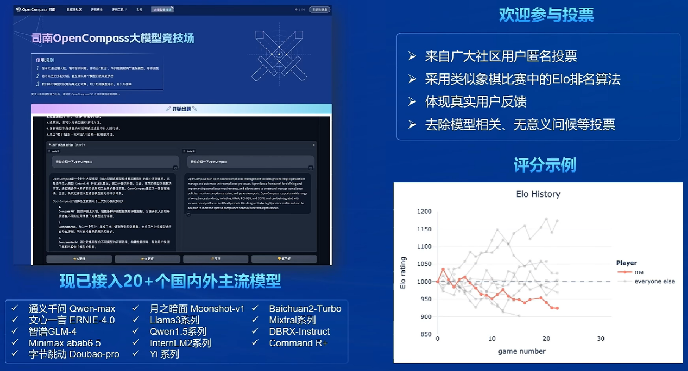


## 司南评测研究成果
### CompassResearch 学术成果速览
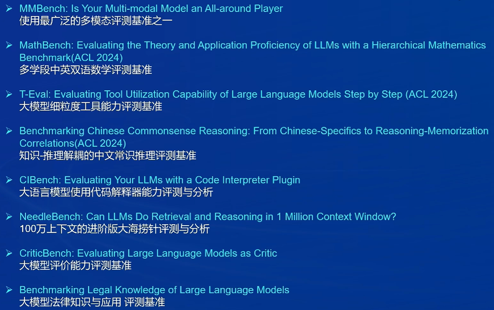

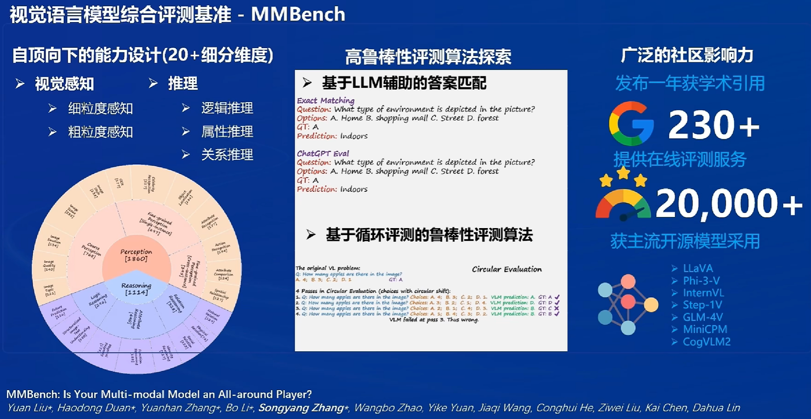

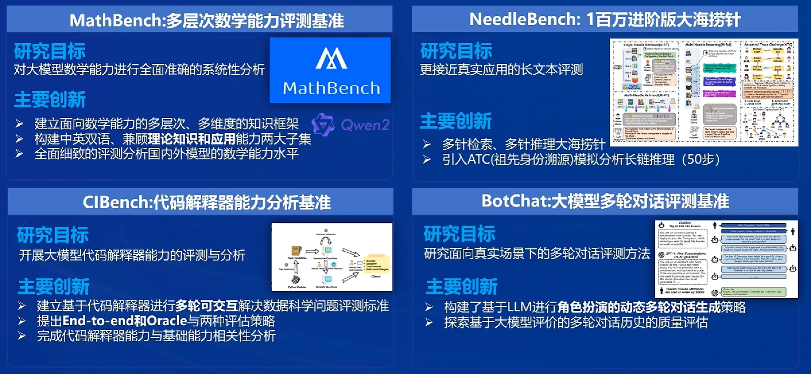


## 下一代 LLM 评测发展方向
* 面向 AGI 的评测体系设计
* 大模型动态评测自动化构建策略
* 复杂智能体评测系统
* 模型性能 Scaling Law 分析与探索
* 能力来源与泛化性分析
* 可靠的自动化主观评测


## 使用 OpenCompass 评测浦语 API 
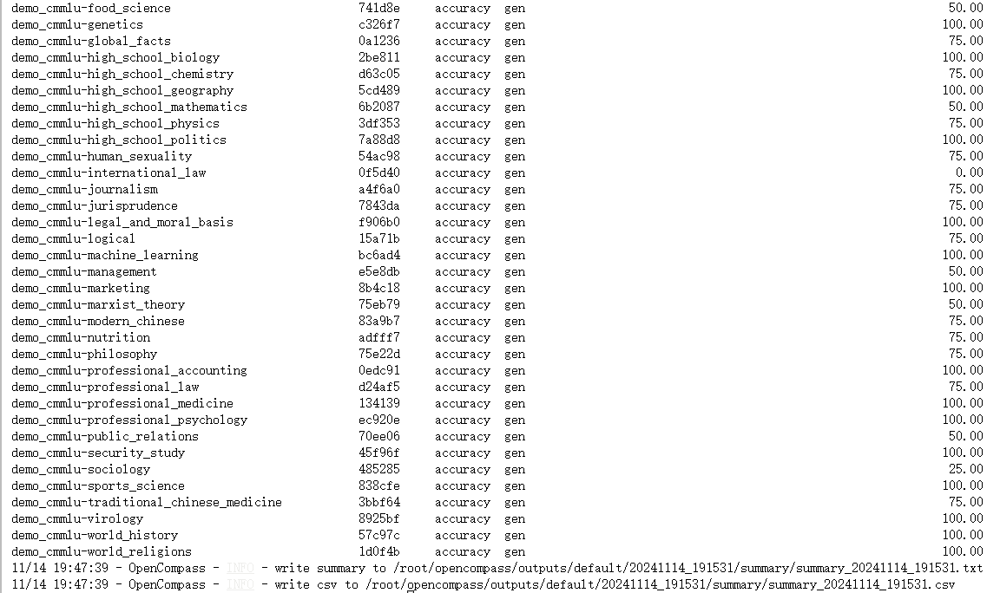


## 使用 OpenCompass 评测 internlm2.5-chat-1.8b 模型在 ceval 数据集上的性能
### 环境及安装依赖
```shell
cd /root/opencompass
conda activate opencompass
conda install torch==2.1.2 pytorch==2.1.2 torchvision==0.16.2 torchaudio==2.1.2 pytorch-cuda=12.1 -c pytorch -c nvidia -y
apt-get update
apt-get install cmake
pip install protobuf==4.25.3
pip install huggingface-hub==0.23.2
```
    
  注意：这里需要 torch 也是 2.1.2 才能跑通


### 输出出所有跟 InternLM 及 C-Eval 相关的配置
```shell
python tools/list_configs.py internlm ceval
```


### 进行测评
```shell
 python run.py --datasets ceval_gen --models hf_internlm2_5_1_8b_chat --debug
```
 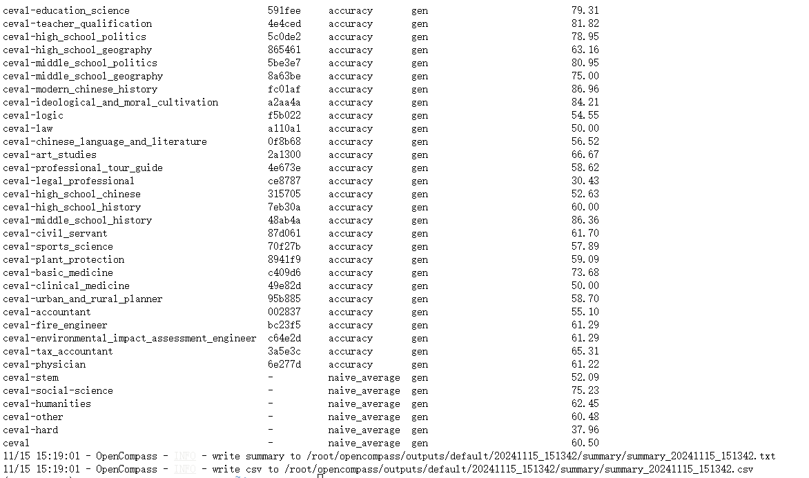


### 使用配置文件来指定数据集和模型
```shell
python run.py configs/eval_tutorial_demo.py --debug 
```

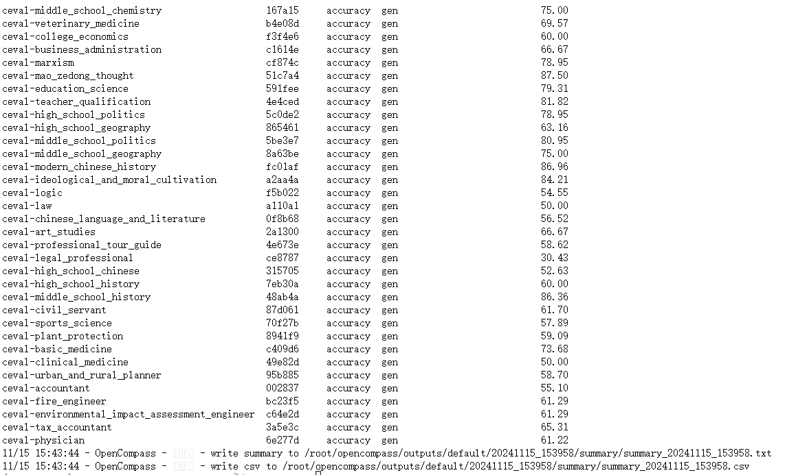


## 将本地模型通过部署成 API 服务再评测
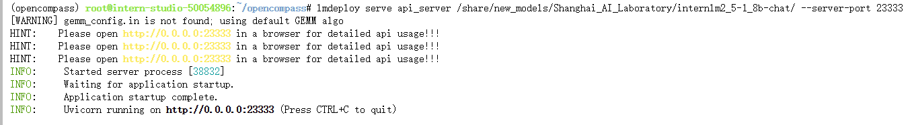


### 获取由 LMDeploy 注册的模型名称
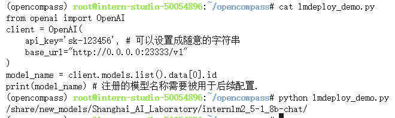


### 进行测评
```shell
opencompass --models hf_internlm2_5_1_8b_chat_api --datasets ceval_gen --debug
```

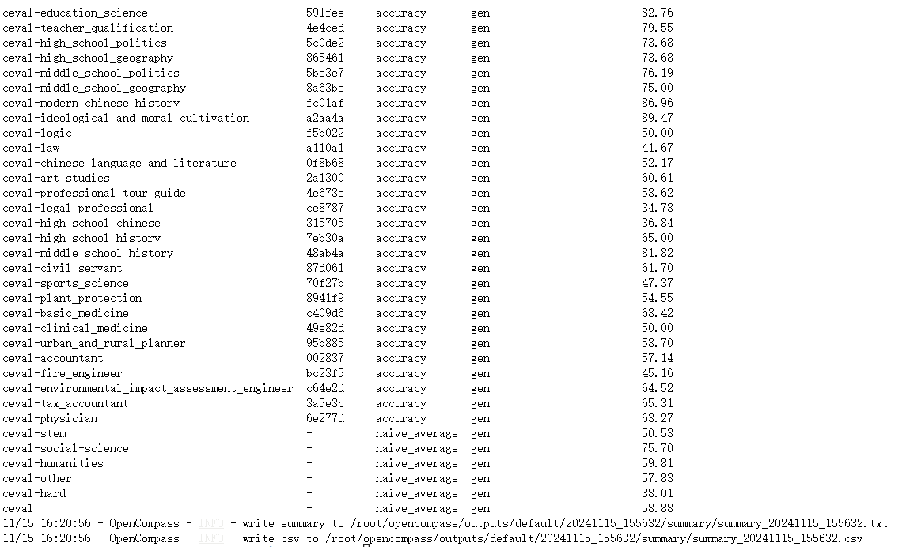