# Lagent 自定义你的 Agent 智能体
## Lagent: 从零搭建你的 Multi-Agent
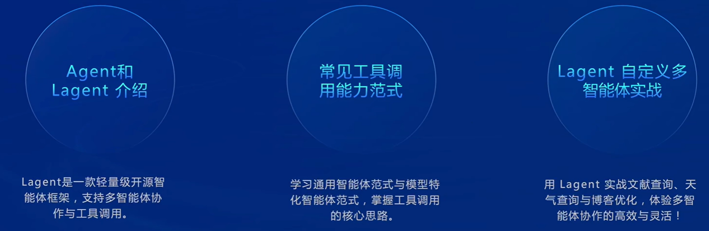

## Agent
### Agent 基础介绍
* Agent 是一种能够自主感知环境并根据感知结果采取行动的实体，以感知序列为输入，以动作作为输出的函数。
* 它可以以软件形式(如聊天机器人、推荐系统)存在，也可以是物理形态的机器(如自动驾驶汽车、机器人)。

基本特性：
* 自主性: 能够在没有外部干预的情况下做出决策。
* 交互性: 能够与环境交换信息。
* 适应性: 根据环境变化调整自身行为。
* 目的性: 所有行为都以实现特定目标为导向。

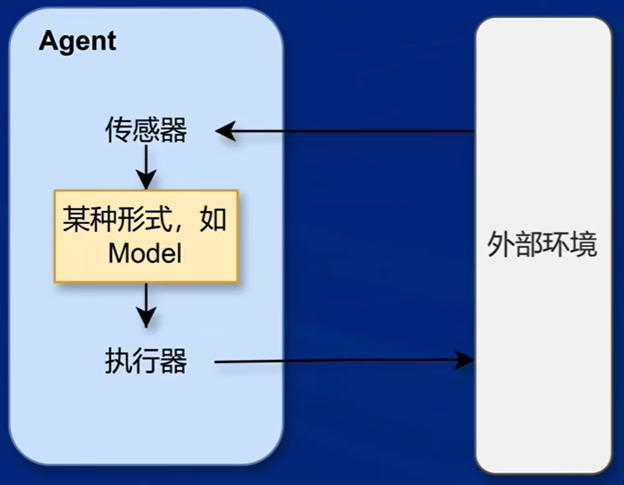

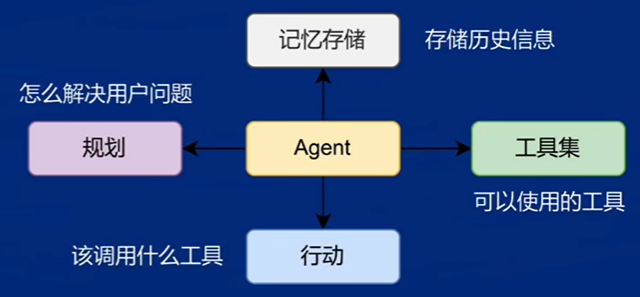

### Agent的应用场景
Agent技术的应用领域其实十分广泛，涵盖了从交通、医疗到教育、家居和娱乐等生活的方方面面，以下列举2个实际例子。

（1）自动驾驶系统
* 应用：自动驾驶汽车、出租车等。
* 目标：安全、快捷、守法、舒适和高效。
* 传感器：摄像头、雷达、定位系统等。
* 执行器：方向盘、油门、刹车、信号灯。

（2）医疗诊断系统
* 应用：医院诊断、病情监控。
* 目标：精准诊断、降低费用。
* 传感器：症状输入、患者自述。
* 执行器：检测、诊断、处方。

## Lagent 介绍
### Lagent 框架介绍
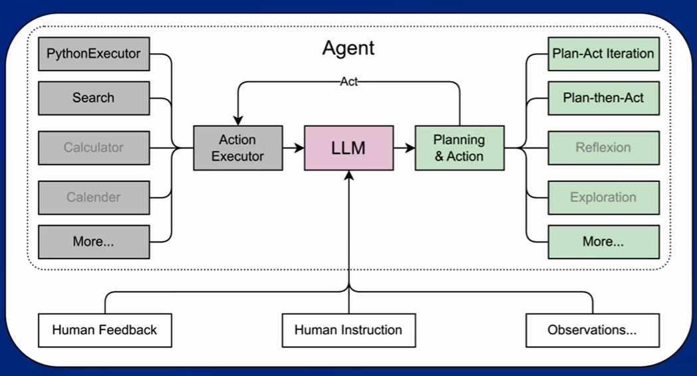

* Lagent 是一个轻量级的开源框架，旨在帮助用户高效地构建基于大语言模型(LLM)的智能体。
* 该框架支持多种智能体范式，如 ReAct、AutoGPT 和 ReWOO,能够驱动 LLM 进行多轮推理和功能调用。

Lagent框架目前集成了如下工具:
* Arxiv 搜索
* Bing 地图
* Google 学术搜索
* Google 搜索
* 交互式 IPython 解释器
* IPython 解释器
* PPT
* Python 解释器

## 范式
### 通用智能体范式
* 通用智能体范式强调模型在工具调用过程中，无需依赖特定的特殊标记(special token)来定义参数边界。
* 模型依靠其强大的指令跟随与推理能力，在指定的 system prompt 框架下，根据任务需求自动生成响应。
* 这种方式使模型在推理过程中更灵活地适应多种任务，无需对 Tokenizer 进行特殊设计。

* 典型例子: ReAct(Reasoning and Acting)范式
* 模型的推理过程分为“推理(Reason)”和“行动(Action)”两个步骤，交替执行，直至获得最终结果。
* 推理(Reason): 生成分析步骤，解释当前任务的上下文或状态,帮助模型理解下一步行动的逻辑依据。
* 行动(Action): 基于推理结果,生成具体的工具调用请求(如査询搜索引擎、调用 API、数据库检索等)将模型的推理转化为行动。

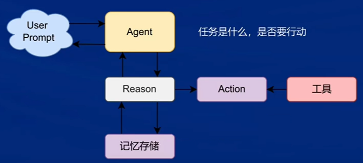

### 模型特化智能体范式
* 模型特化智能体范式强调在模型的工具调用过程中，使用特定的特殊标记(special tokens)来明确调用的起止点。
* 这些标记与模型的分词器(Tokenizer)深度集成,确保在执行特定任务时，模型能够准确识别并执行相应的工具调用。

* 典型例子: InternLM2其中，工具调用使用了如<|plugin|>、<|interpreter|>、<|action_start|>和<|action_end|>等特殊标记，确保每个调用都符合指定的格式。
* 模型在执行任务时，依靠这些标记与系统紧密协作，保障任务的精准执行。

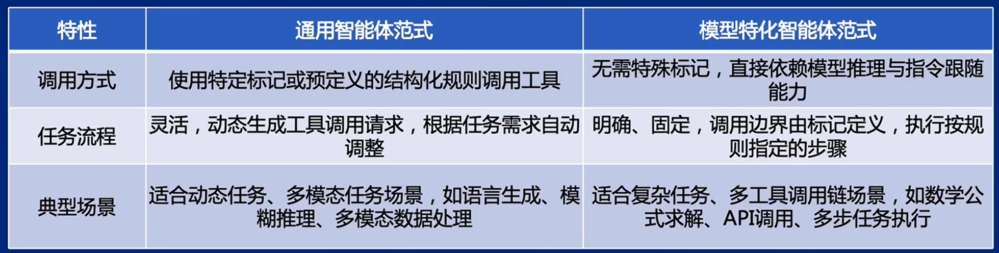

## Lagent 框架中 Agent 的使用
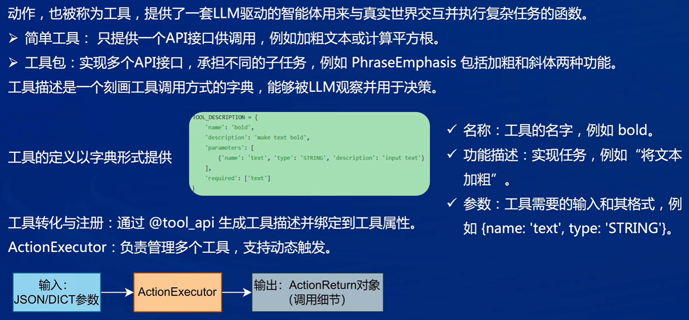

### 让大模型学会搜文献
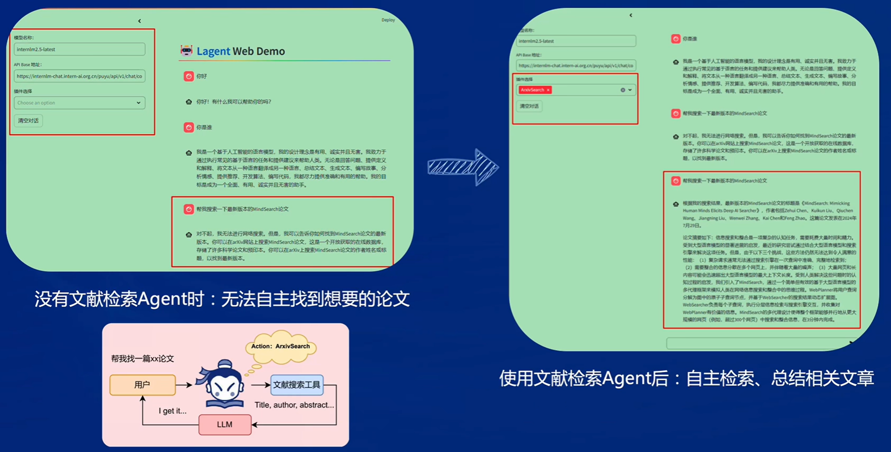

#### 没有插件时
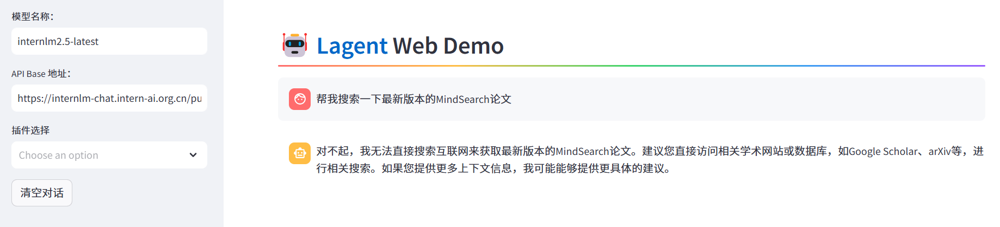

#### 使用插件后
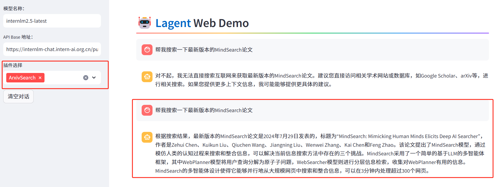

### 自定义大模型天气助手
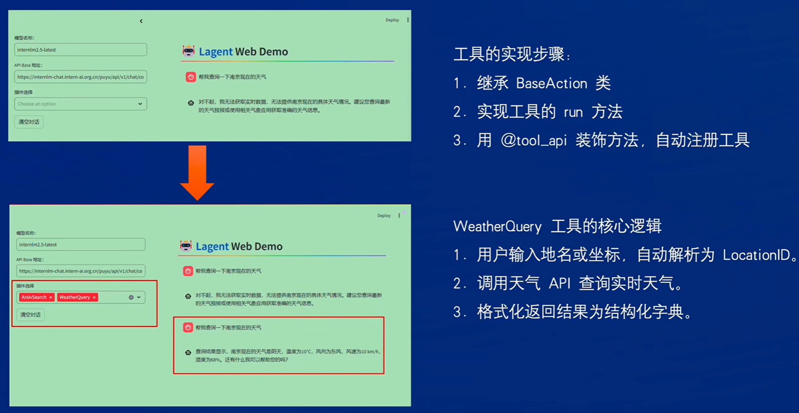

#### 使用插件前
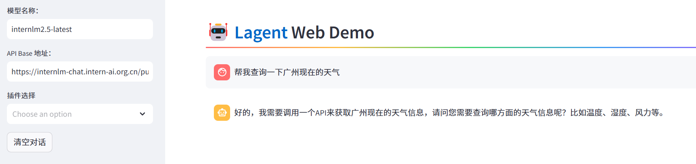

#### 使用插件后
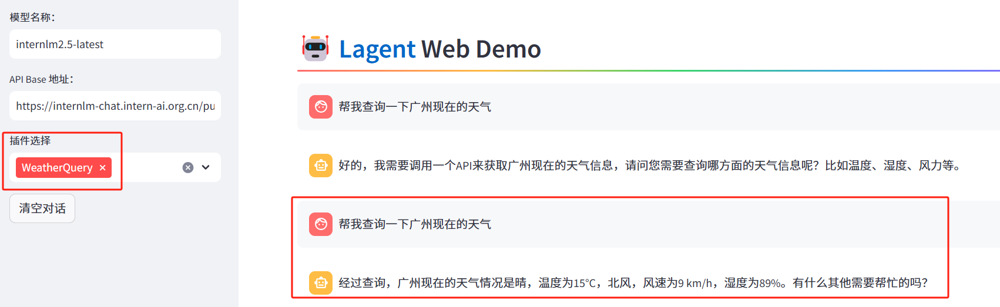

### Multi-Agents 博客写作系统的搭建
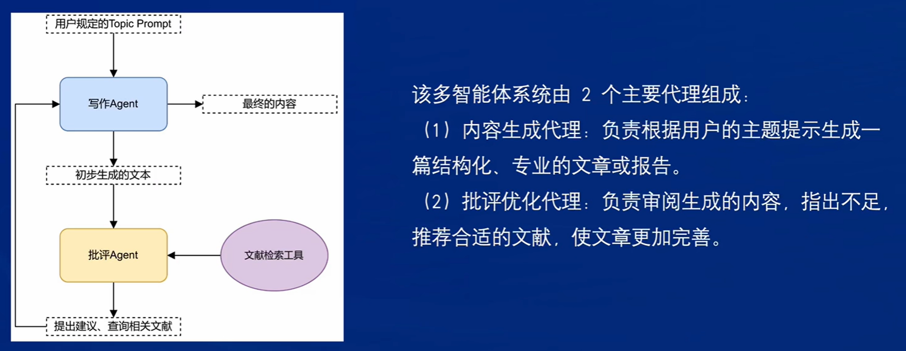

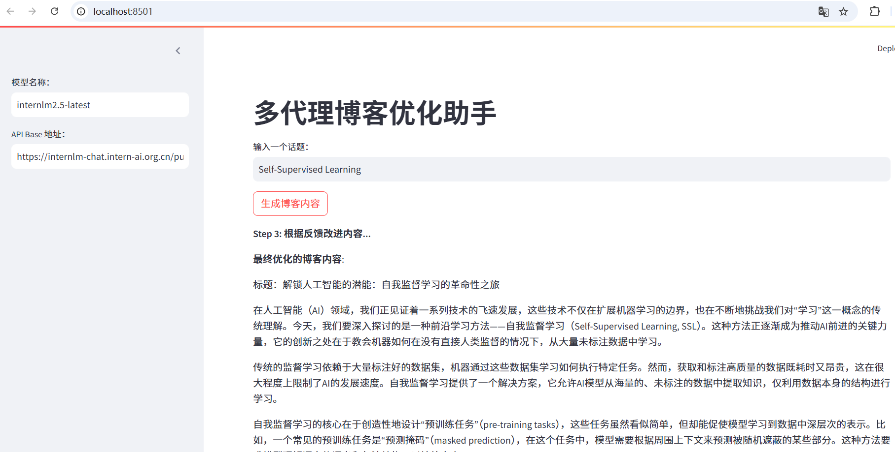

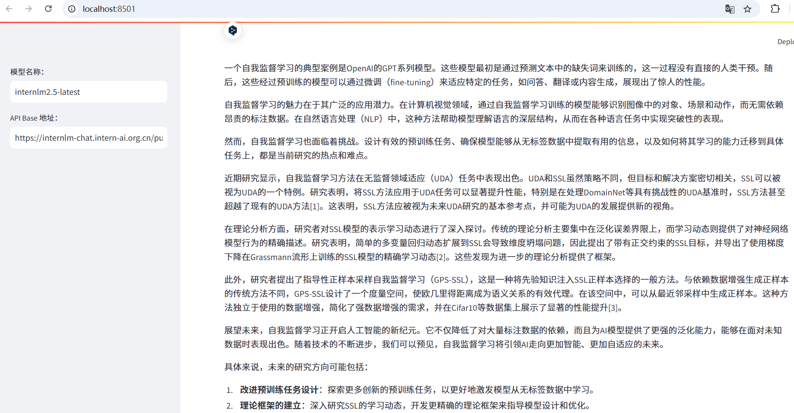

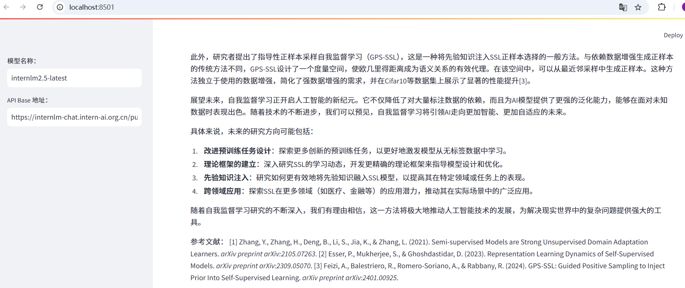