# InternVL 多模态模型部署微调实践
## InternVL2-2B 美食家微调实战
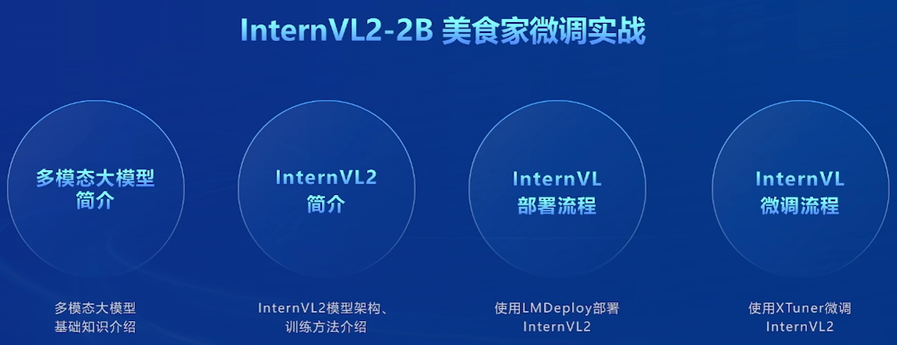

### 什么是 MLLM
* 多模态大语言模型(Multimodal Large Lanquage Model)是指能够处理和融合多种不同类型数据(如文本、图像、音频视频等)的大型人工智能模型。
* 这些模型通能够理解和生成多种模态的数据，从而在各种复杂的应用场景常基于深度学习技术，中表现出强大的能力。
* 常见的 MLLM
  * InternVL
  * GPT-4o
  * Qwen-VL
  * LLaVA

## 多模态研究的重点是不同模态特征空间的对齐
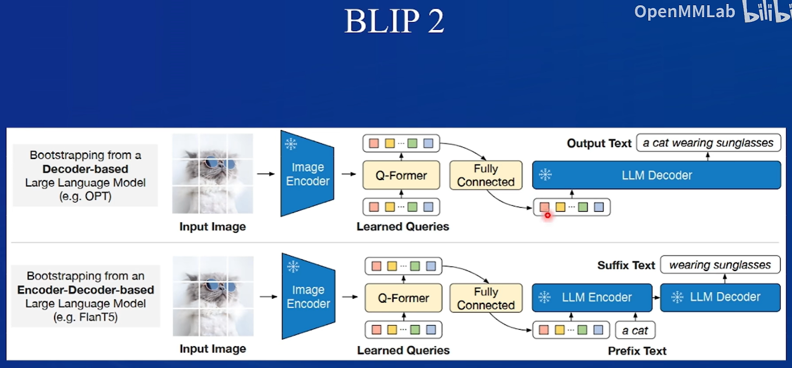

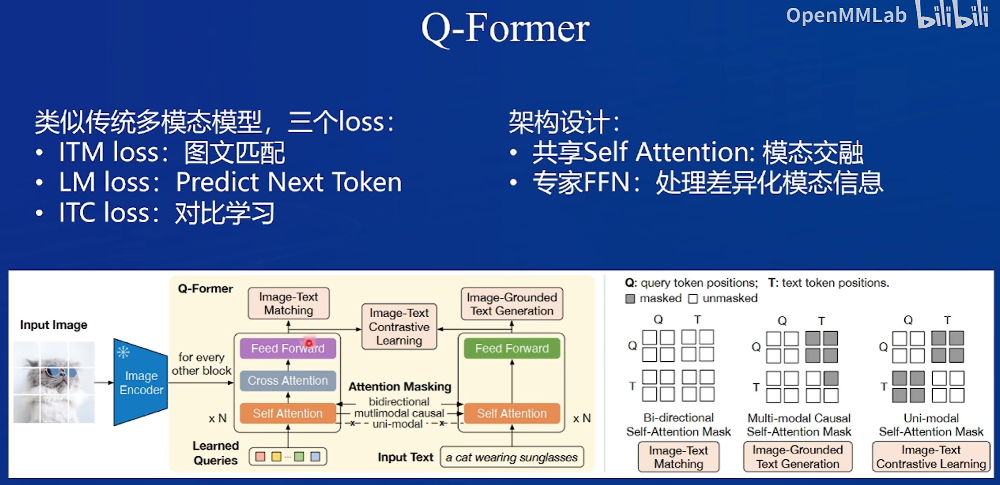

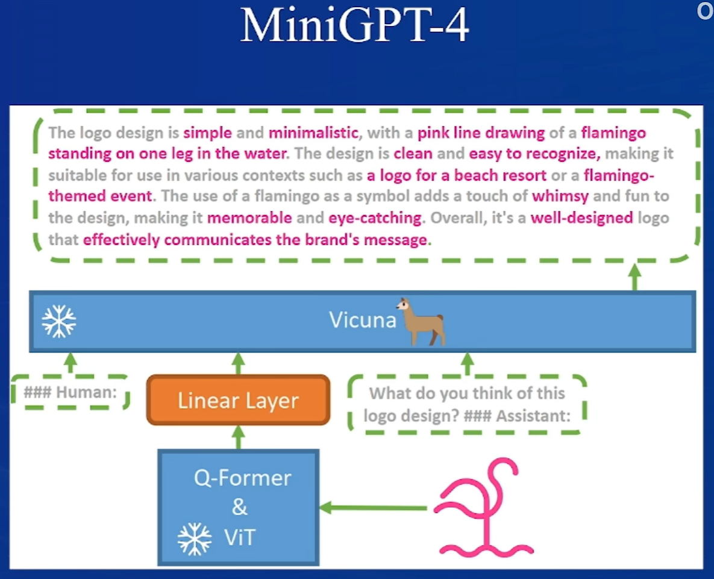

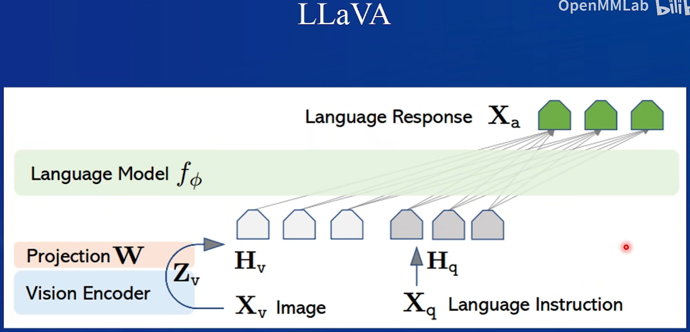

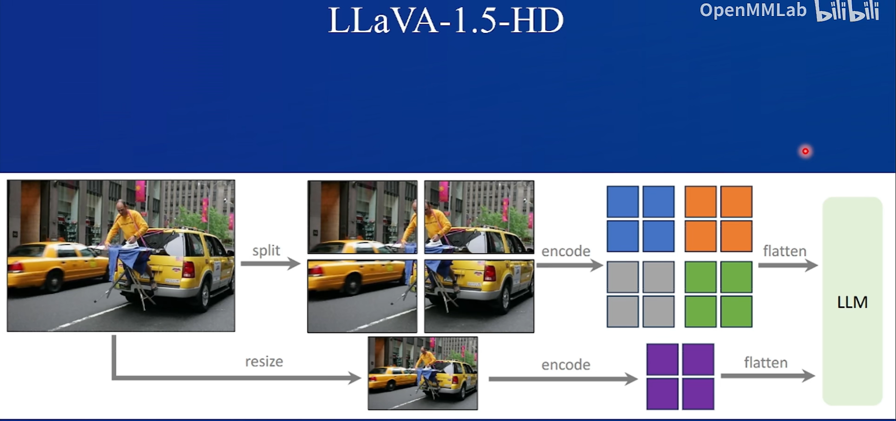

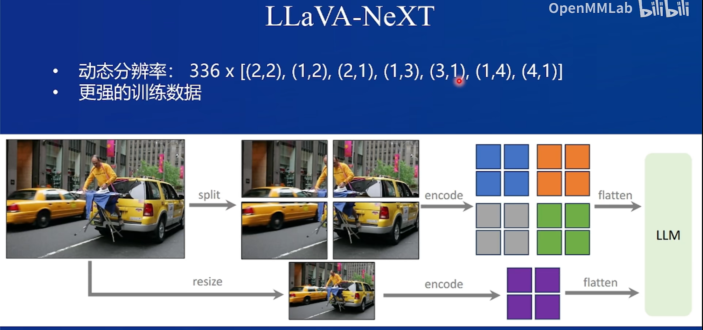

## InternVL2 是怎么做的?
* LLaVA 式架构设计(ViT-MLP-LLM)
  * InternLM2-20B
  * InternViT-6B
  * MLP

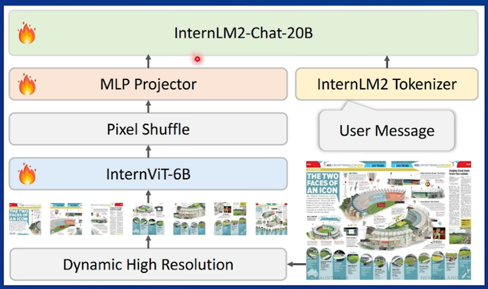

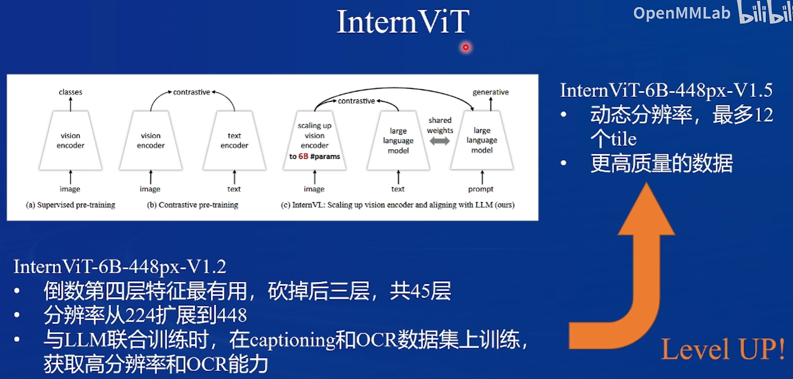

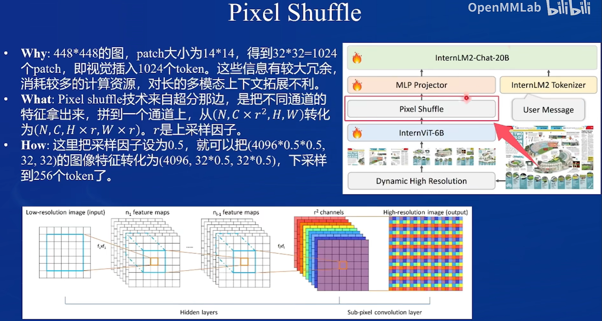

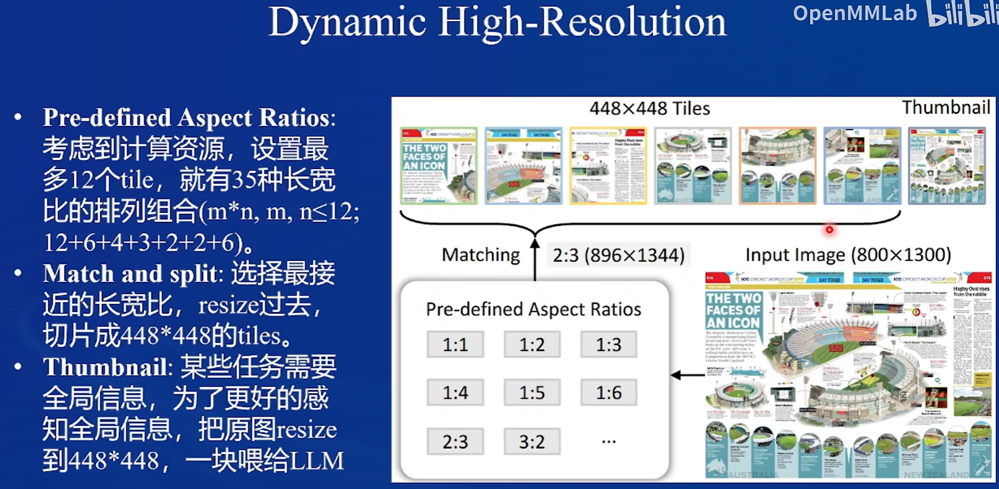

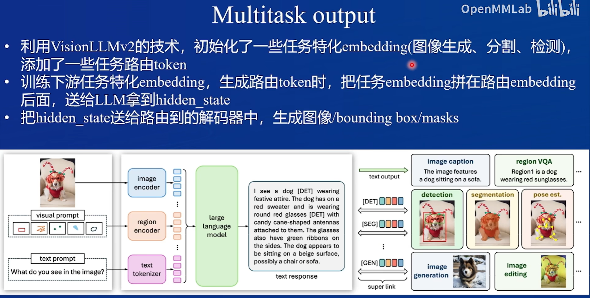

### 训练
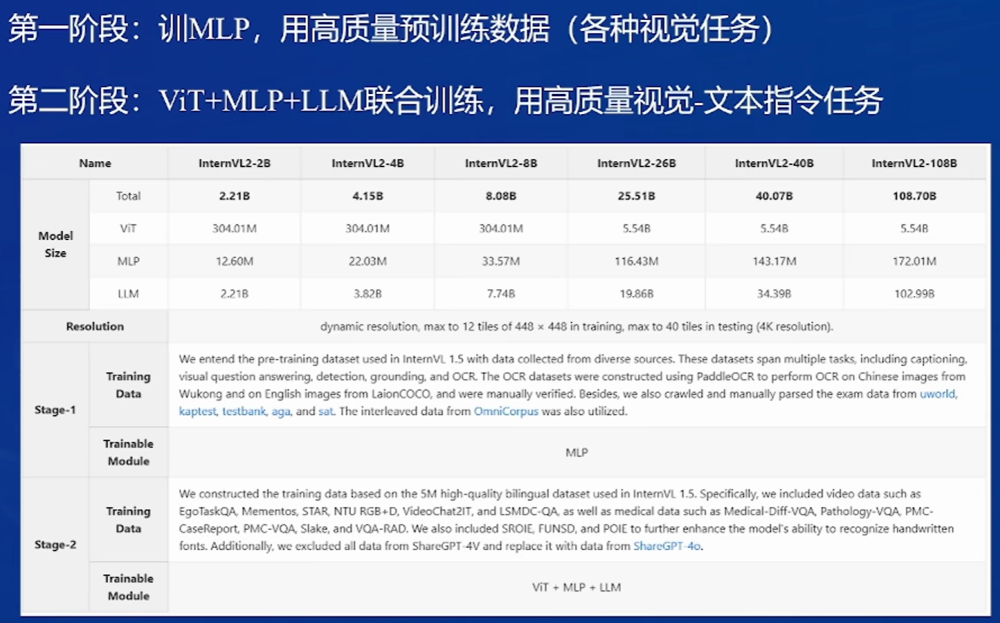

## LMDeploy
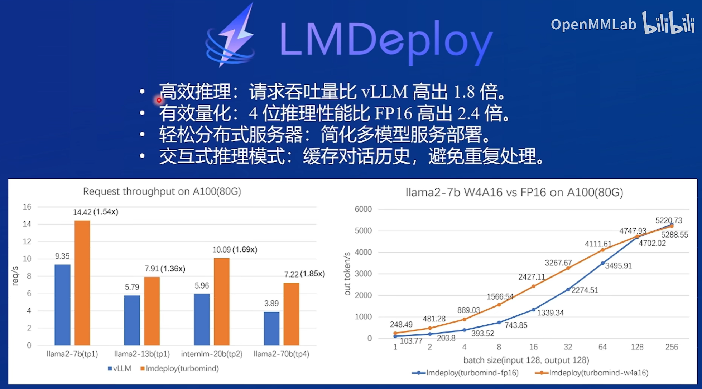

## 网页应用部署
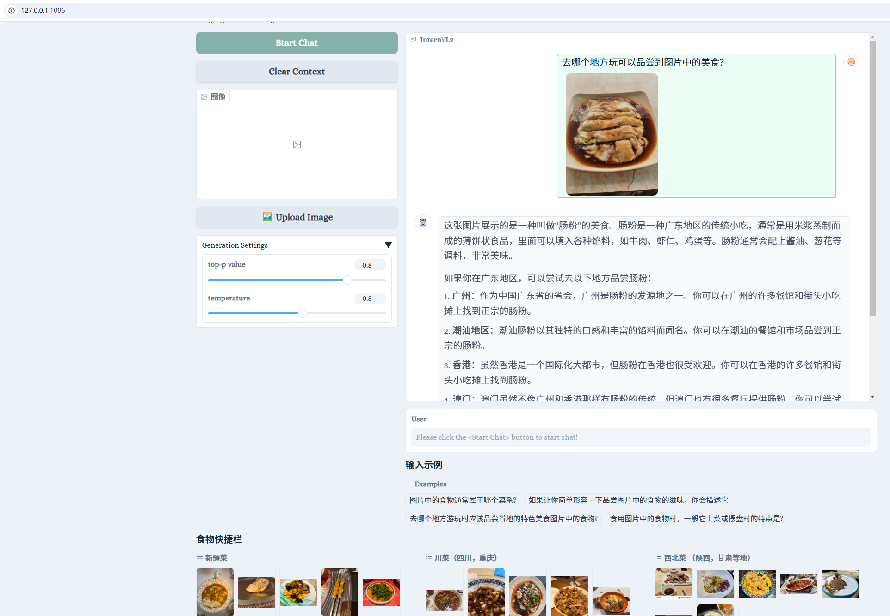

## XTuner 微调实践
* 微调完之后
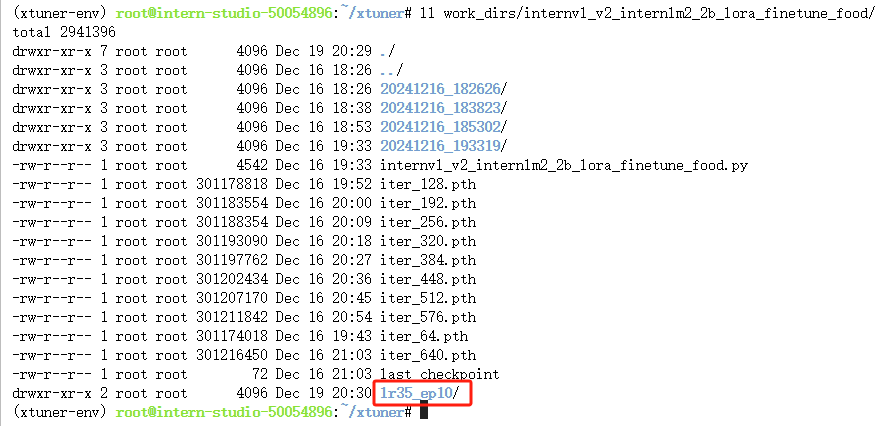

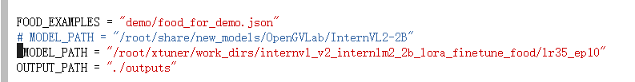

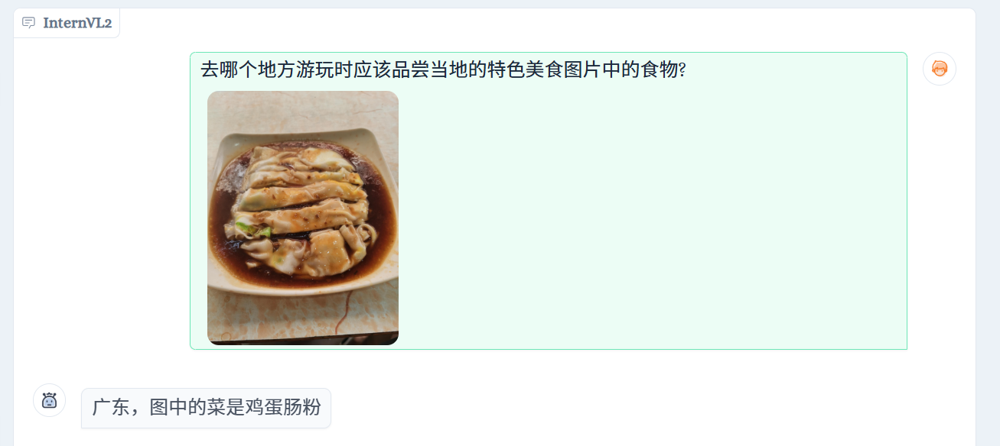
