# 茴香豆：企业级知识库问答工具
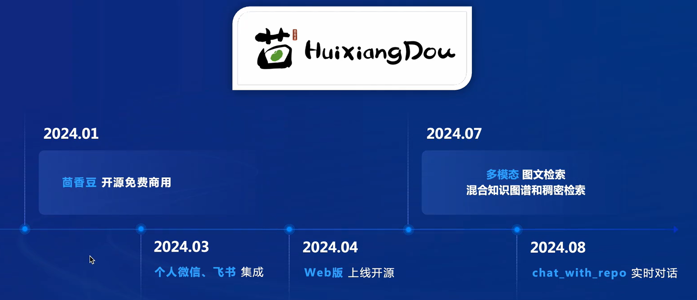

## 实际 RAG 场景痛点
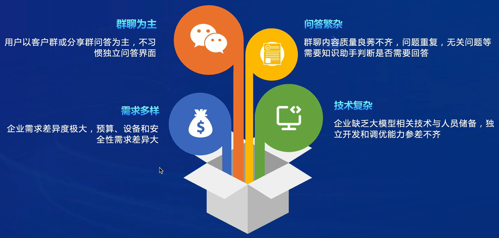

## 茴香豆介绍
* HuixiangDou 是一个基于 LLM 的领域知识助手，由书生浦语团队开发的开源大模型应用
  * 专为国内企业级应用场景设计、调优，经过 大量实际场景和数据验证
  * 多场景和行业适配，支持 CPU-only 或 2G-80G 显卡场景,灵活匹配各种规模企业需求，多种部署方式
  * 支持丰富的技术栈，全流程配置文件调试，满足初级至高级的应用，可以实现开箱即用

* 场景
  * 智能客服群聊: 技术支持、领域知识对话，回答重复度高、专业性强等问题，节省人工回复成本，提升工作效率
  * 茴香豆能够快速在群聊中搭建自动应答系统，帮助维护者减轻开发和运营成本的同时，有效提高问答效率

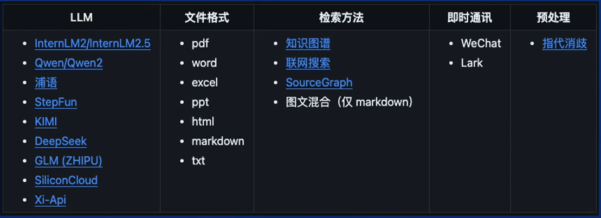

## 茴香豆的核心特性
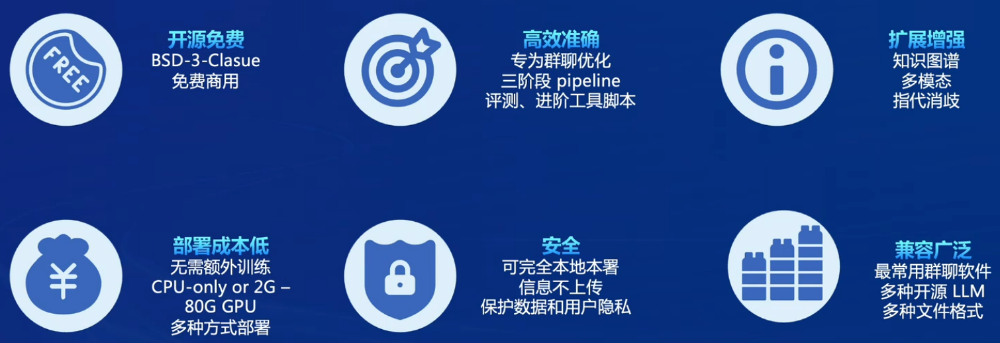

* 茴香豆特点：
  * 三阶段 Pipeline （前处理、拒答、响应），提高相应准确率和安全性
  * 打通微信和飞书群聊天，适合国内知识问答场景
  * 支持各种硬件配置安装，安装部署限制条件少
  * 适配性强，兼容多个 LLM 和 API
  * 傻瓜操作，安装和配置方便

## 茴香豆构建
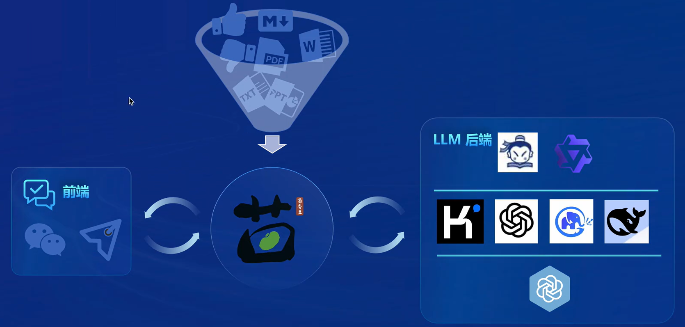

* 回答问题都是基于知识库

## 茴香豆的三阶段 pipeline
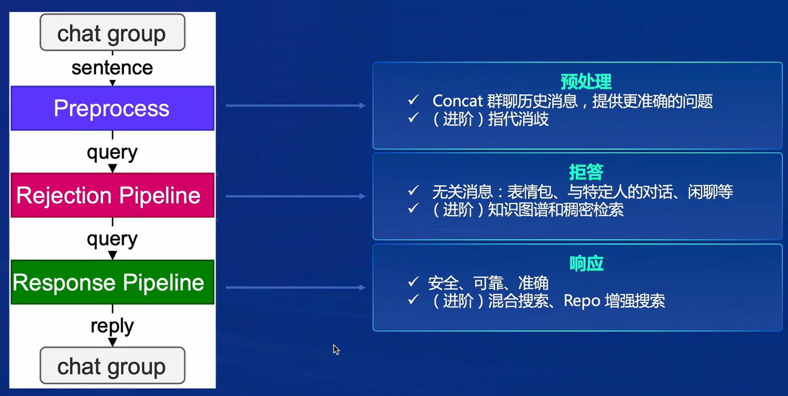

### 指代消歧
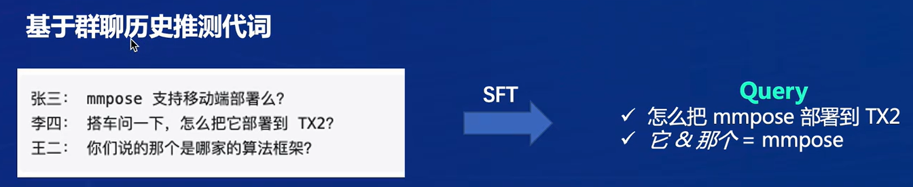

### 拒答 pipeline
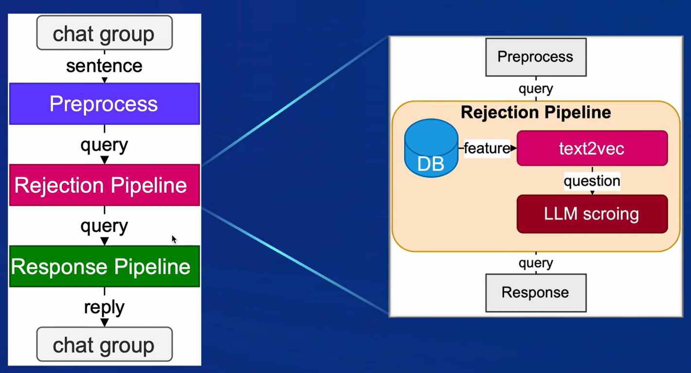

* 涵盖大模型评分机制判断问题
* 使用正反例调教

### 知识图谱和混合稠密检索
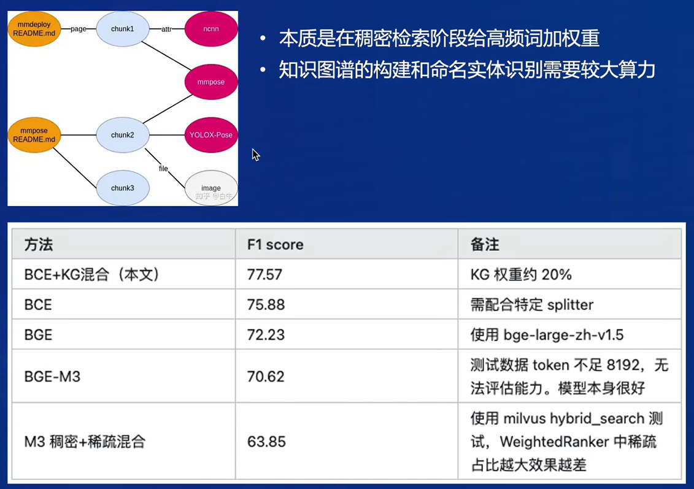

### 响应 pipeline
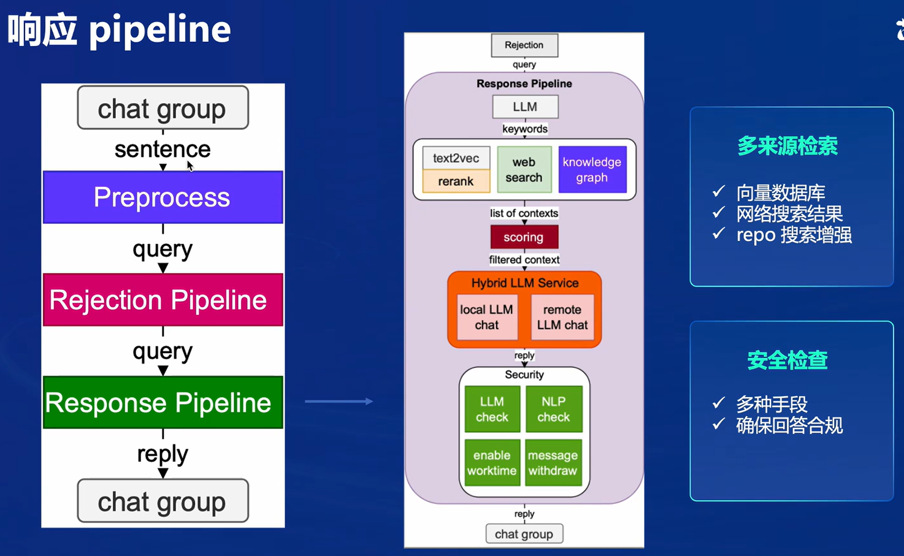

## Web 版茴香豆
### 创建 Web 版茴香豆知识库
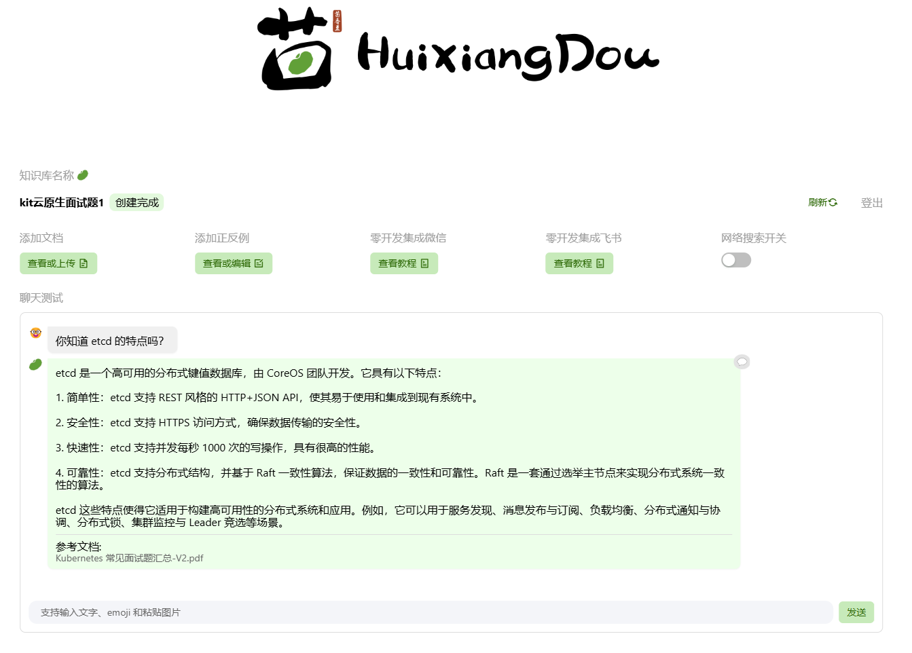

### 添加正反例
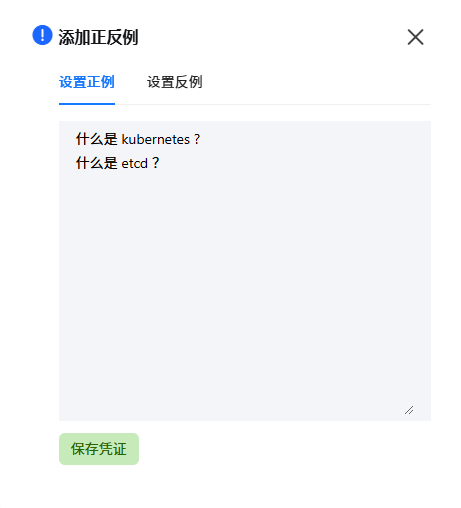

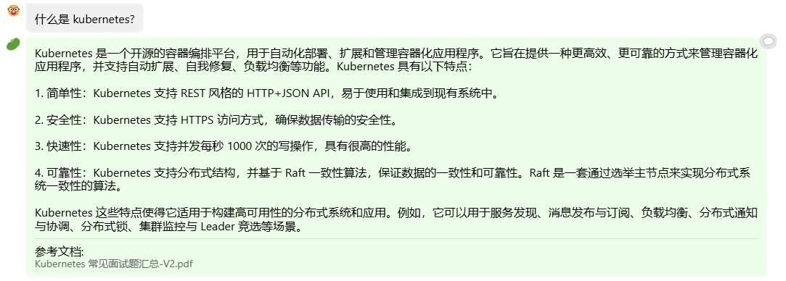

## 茴香豆本地标准版搭建
### 知识库创建
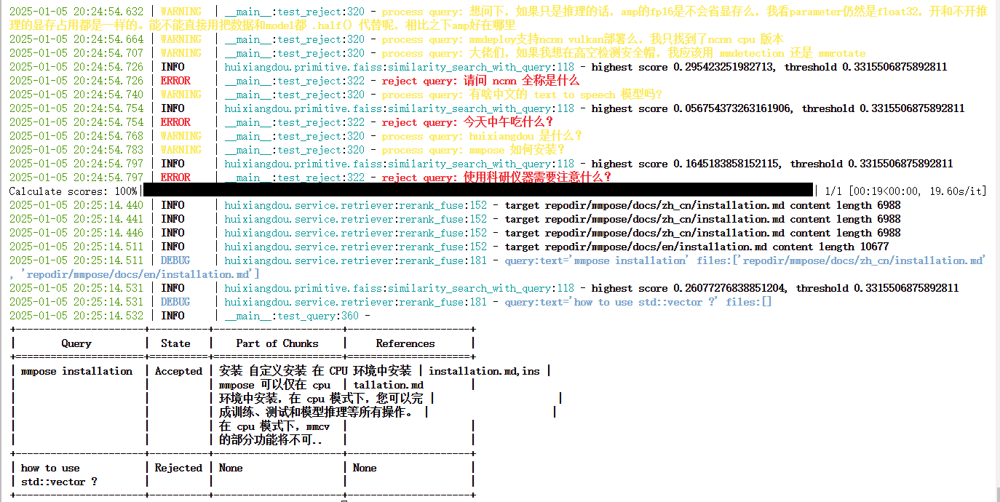

### 测试知识助手
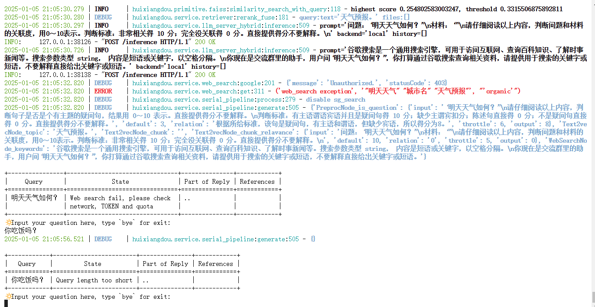

### Gradio UI 界面测试
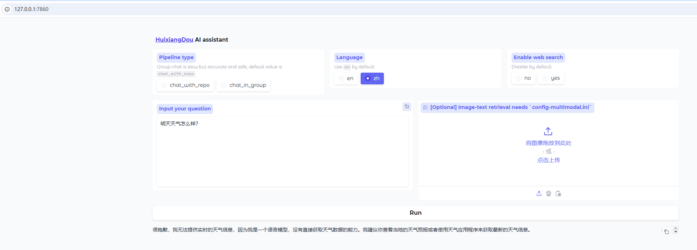

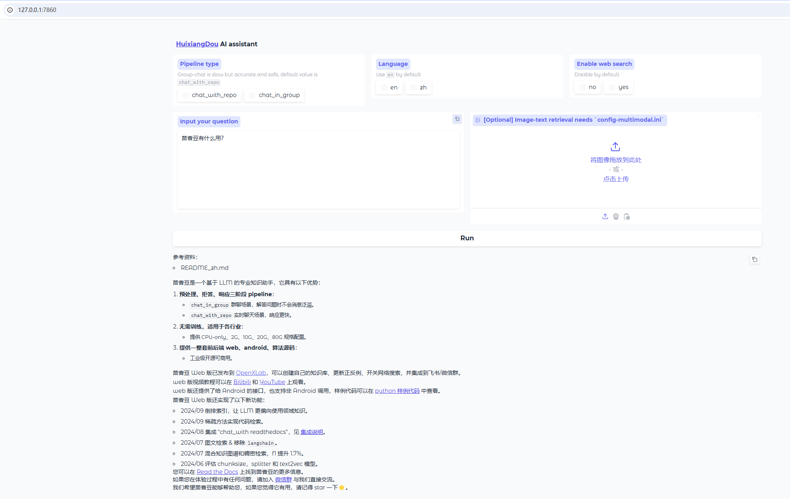