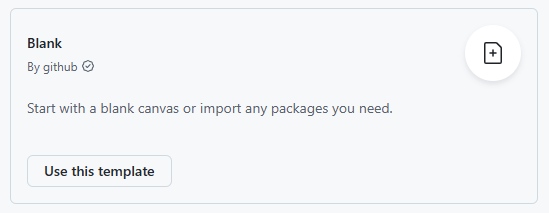
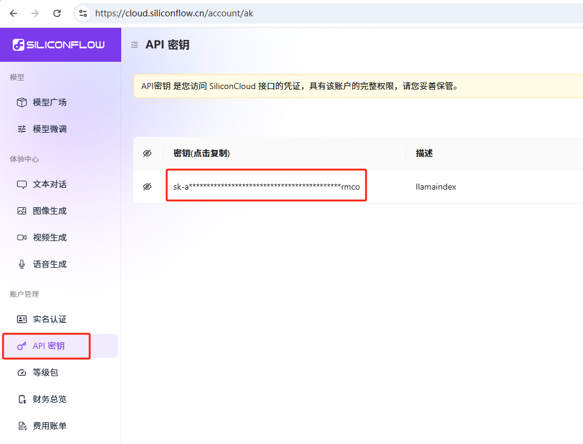
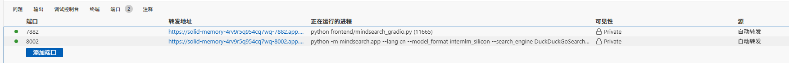
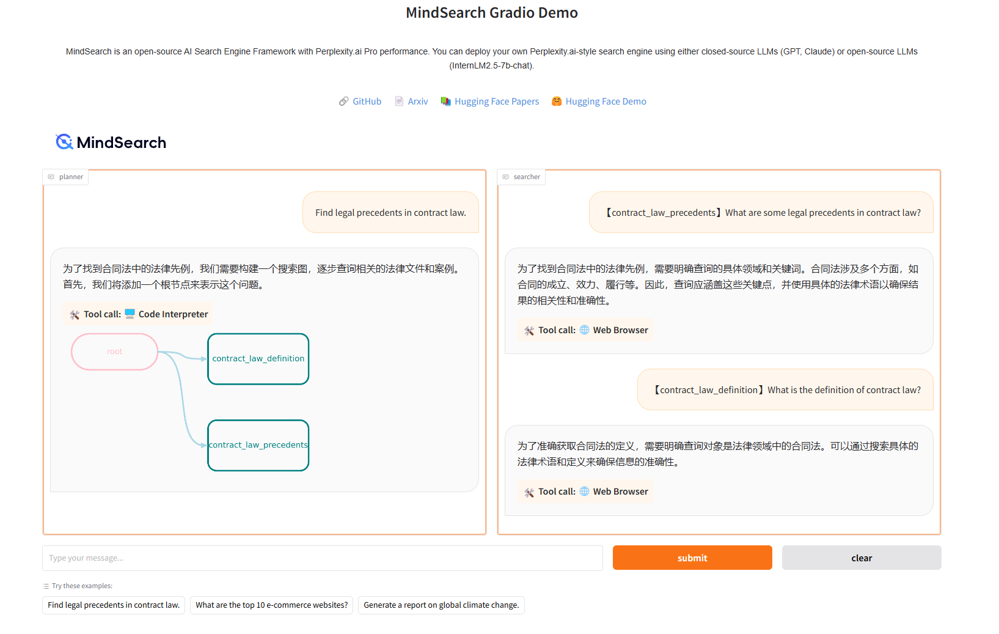
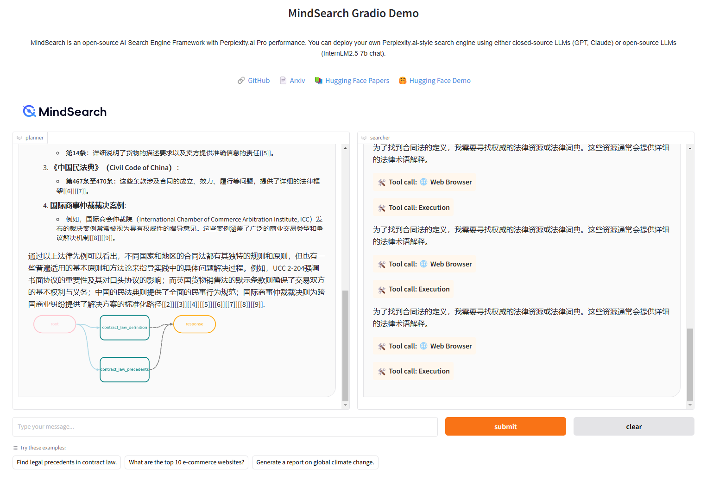
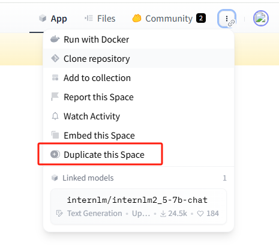
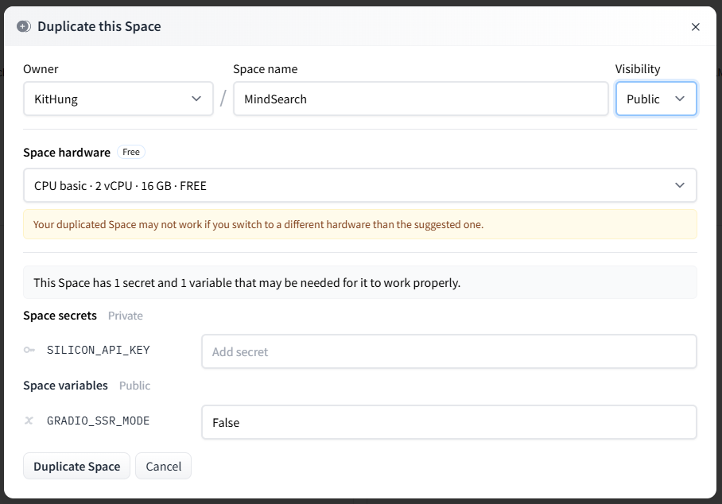
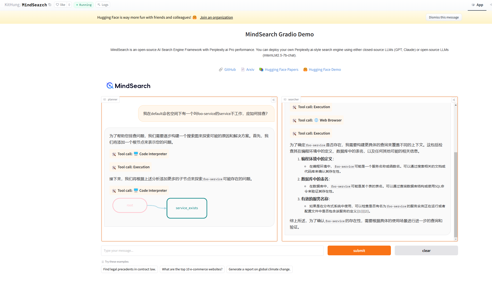

# MindSearch 快速部署
## MindSearch 简介
* MindSearch 是一个开源的 AI 搜索引擎框架，具有与 Perplexity.ai Pro 相同的性能。


### 特性
* 🤔 任何你想知道的问题：MindSearch 通过搜索解决你在生活中遇到的各种问题
* 📚 深度知识探索：MindSearch 通过数百个网页的浏览，提供更广泛、深层次的答案
* 🔍 透明的解决方案路径：MindSearch 提供了思考路径、搜索关键词等完整的内容，提高回复的可信度和可用性。
* 💻 多种用户界面：为用户提供各种接口，包括 React、Gradio、Streamlit 和本地调试。根据需要选择任意类型。
* 🧠 动态图构建过程：MindSearch 将用户查询分解为图中的子问题节点，并根据 WebSearcher 的搜索结果逐步扩展图。


## 开发环境配置
* 使用 Blank 模板




### 创建 conda 环境隔离并安装依赖
```shell
conda create -n mindsearch python=3.10 -y
conda init
```

* 另起终端
```shell
conda activate mindsearch

cd /workspaces/codespaces-blank
git clone https://github.com/InternLM/MindSearch.git && cd MindSearch && git checkout ae5b0c5

pip install -r requirements.txt
```


### 获取硅基流动 API KEY
* 网址： https://cloud.siliconflow.cn/
* 


### 启动 MindSearch
#### 启动后端
```shell
export SILICON_API_KEY=<上面复制的API KEY>
conda activate mindsearch

# 进入你clone的项目目录
cd /workspaces/codespaces-blank/MindSearch
python -m mindsearch.app --lang cn --model_format internlm_silicon --search_engine DuckDuckGoSearch --asy
```

* --lang: 模型的语言，en 为英语，cn 为中文。
* --model_format: 模型的格式。
  * internlm_silicon 为 InternLM2.5-7b-chat 在硅基流动上的 API 模型
* --search_engine: 搜索引擎。
  * DuckDuckGoSearch 为 DuckDuckGo 搜索引擎。
  * BingSearch 为 Bing 搜索引擎。
  * BraveSearch 为 Brave 搜索引擎。
  * GoogleSearch 为 Google Serper 搜索引擎。
  * TencentSearch 为 Tencent 搜索引擎。


#### 启动前端
```shell
conda activate mindsearch
# 进入你clone的项目目录
cd /workspaces/codespaces-blank/MindSearch
python frontend/mindsearch_gradio.py
```


* 前后端都启动后有两个端口转发
* 






## 部署到自己的 HuggingFace Spaces 上
* 网址： https://huggingface.co/spaces/internlm/MindSearch
* 
* 
* 我的部署网址： https://huggingface.co/spaces/KitHung/MindSearch
* 
