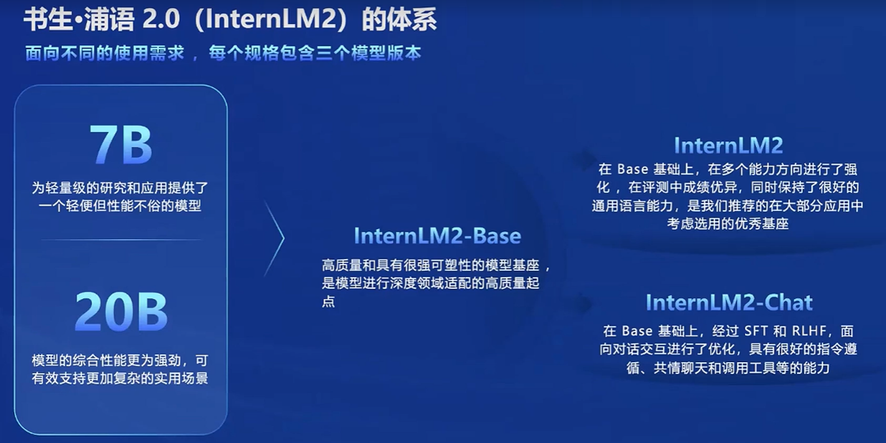
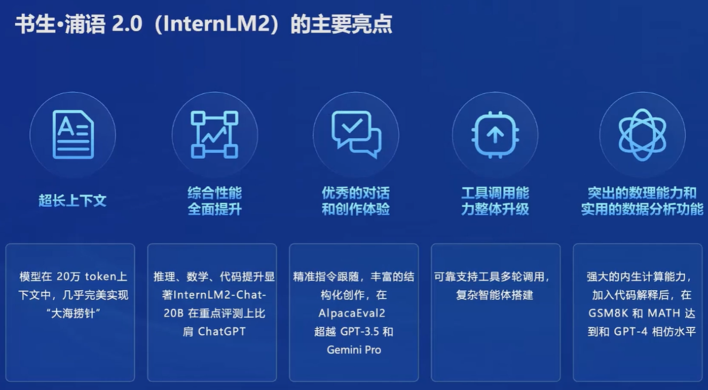
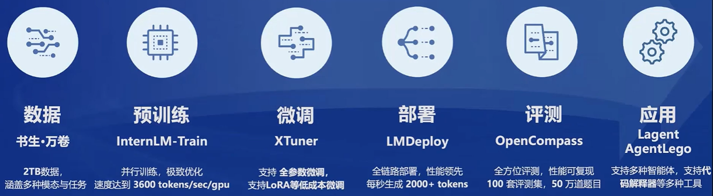
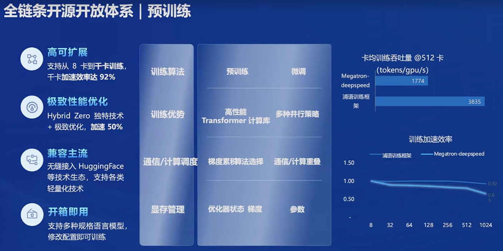
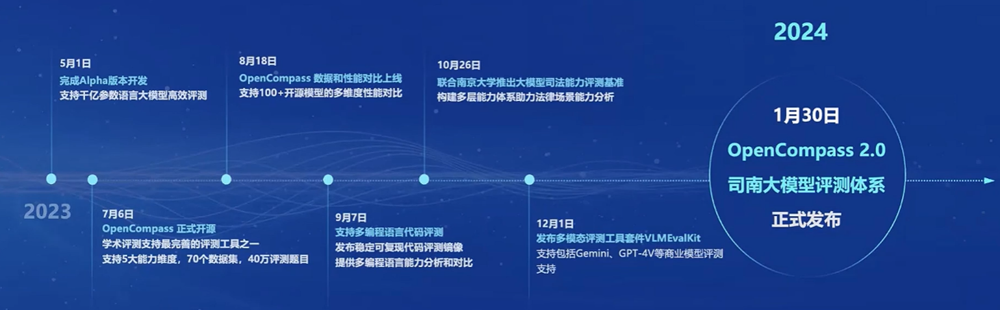
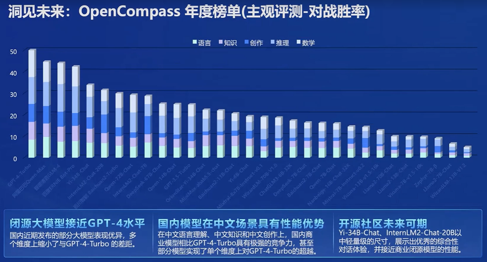

# 书生·浦语
## 开源历程

## 2.0 （InternLM2）体系

1. InternLM2-Base：高质量、强可塑的模型基座，是高质量模型的起点
2. InternLM2：在 Base 基础上，进行了多个能力方向强化，推荐在大部分应用中选用
3. InternLM2-Chat：在 Base 基础上，经过 SFT 和 RLHF，面向对话交互进行了优化，具有很好的指令遵循、共情聊天和调用工具的能力。

## 主要亮点

1. 超长上下文：在 20 万 token 上下文中，几乎完美实现“大海捞针”
2. 综合性能全面提升：InternLM2-Chat-20B 在重点测评上比肩 ChatGPT
3. 优秀的对话和创作体验：在 AIpacaEval2 超越 GPT-3.5 和 Gemini Pro
4. 工具调用能力整体提升：可靠支持工具多轮调用，复杂智能体搭建
5. 突出的数理能力和实用的数据分析功能：加入代码解释后，在 GSM8K 和 MATH 达到和 GPT-4 相仿水平

## 从模型到应用的典型流程

## 全链条开源开放体系

1. 开放高质量语料数据
   1. 书生·万卷 1.0
   2. 书生·万卷 CC
2. 预训练
   1. 
3. 微调
   1. 增量续训
   2. 有监督微调
   3. 高效微调框架 XTuner
4. 评测
   1. 
   2. CompassRank：中立全面的性能榜单
   3. CompassKit：大模型评测全栈工具链
   4. CompassHub：高质量评测基准社区
   5. OpenCompass 年度榜单
      1. 
5. 部署
   1. LMDeploy
6. 智能体
   1. 轻量级智能体框架 Lagent
   2. 多模态智能体工具箱 AgentLego

# InternLM2 技术报告
## 模型介绍
1. 开源并具有卓越性能
2. 模型大小：提供了1.8B、7B和20B参数的模型，以适应不同的应用场景。
3. 使用 200k 的上下文窗口设计，支持长上下文的“大海捞针”

## 预训练过程
1. 数据类型：包括文本、代码和长文本数据的多样化数据准备。
2. 长文本依赖：模型能够处理长达32k tokens 的文本，显示出在“针堆”测试中的卓越性能。
3. 预训练阶段：从 4k tokens 的训练开始，逐步过渡到32k tokens 的训练。

## 模型对齐（Alignment）
1. 监督式微调（SFT）：使用高质量的指令数据对模型进行微调，以遵循人类指令。 
2. COOL RLHF：一种新的条件在线强化学习从人类反馈策略，解决偏好冲突和奖励黑客问题。

## 评估与分析
1. 下游任务性能：InternLM2 在语言理解、知识应用、推理、数学问题解决和编码任务中表现出色。
2. 长文本建模：在长文本基准测试中，InternLM2 展现了其处理长文本的能力。

## 技术细节
1. InternEvo框架：用于模型训练的高效轻量级预训练框架，支持大规模GPU扩展。
2. 模型结构：基于Transformer架构，采用RMSNorm和SwiGLU激活函数，优化了训练效率和性能。 

## 数据准备
1. 文本数据：从网页、论文、专利和书籍中收集，经过清洗、去重和安全过滤。 
2. 代码数据：从 GitHub、公共数据集和编程相关资源中收集，经过格式清洗和质量过滤。 

## 长文本处理
   长文本数据：特别为长文本建模准备的数据，经过长度选择、统计过滤和困惑度过滤。

## 工具辅助的LLMs
   工具调用：InternLM2 能够调用外部工具，增强了解决复杂问题的能力。

## 数据污染讨论
   数据集污染：分析了数据集污染对模型性能和可靠性的影响。
