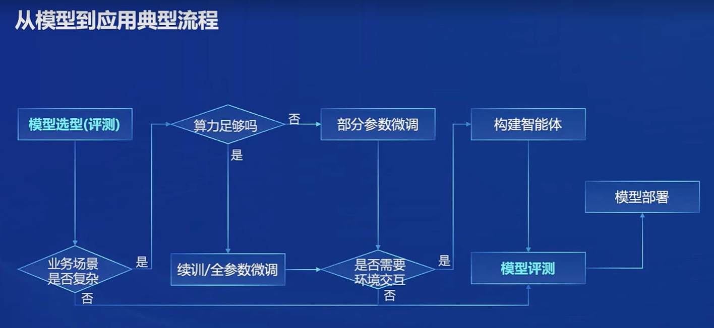

# 书生·浦语 2.0 （InternLM2）
## 体系
1. InternLM2-Base：高质量、强可塑的模型基座，是高质量模型的起点
2. InternLM2：在 Base 基础上，进行了多个能力方向强化，推荐在大部分应用中选用
3. InternLM2-Chat：在 Base 基础上，经过 SFT 和 RLHF，面向对话交互进行了优化，具有很好的指令遵循、共情聊天和调用工具的能力。

## 主要亮点
1. 超长上下文：在 20 万 token 上下文中，几乎完美实现“大海捞针”
2. 综合性能全面提升：InternLM2-Chat-20B 在重点测评上比肩 ChatGPT
3. 优秀的对话和创作体验：在 AIpacaEval2 超越 GPT-3.5 和 Gemini Pro
4. 工具调用能力整体提升：可靠支持工具多轮调用，复杂智能体搭建
5. 突出的数理能力和实用的数据分析功能：加入代码解释后，在 GSM8K 和 MATH 达到和 GPT-4 相仿水平

## 从模型到应用的典型流程

## 全链条开源开放体系

