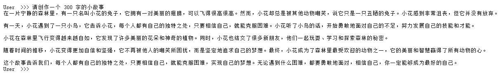
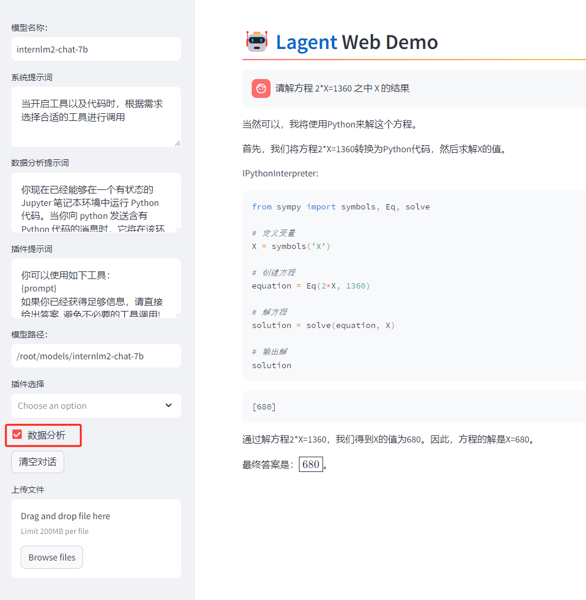
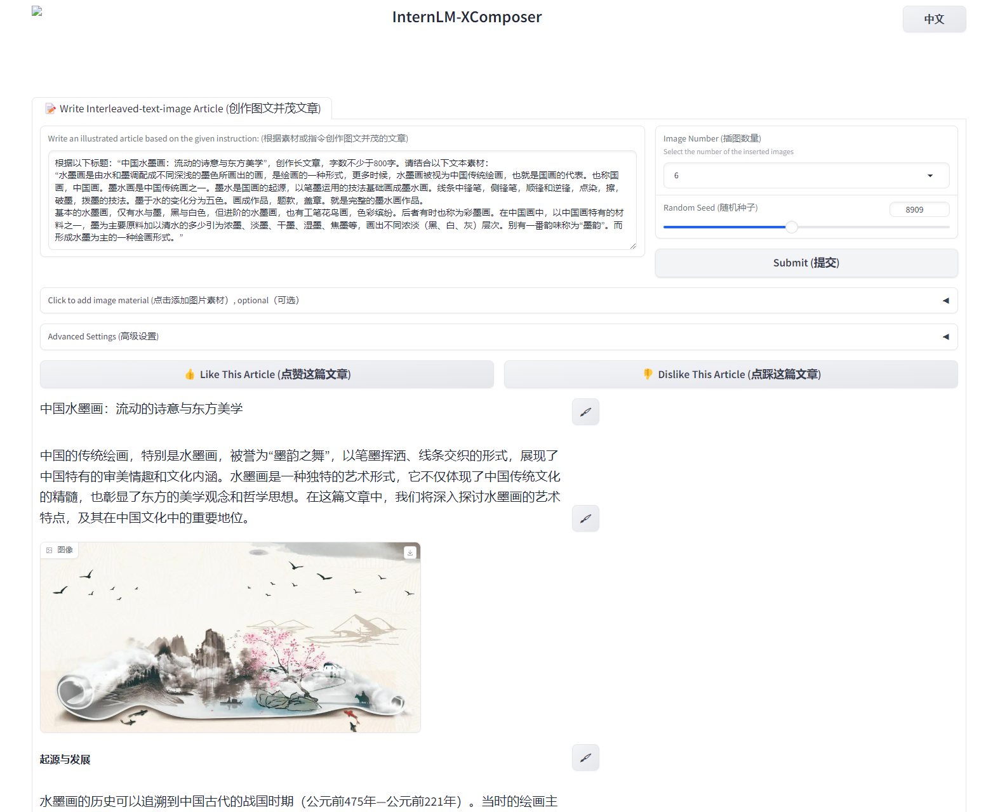
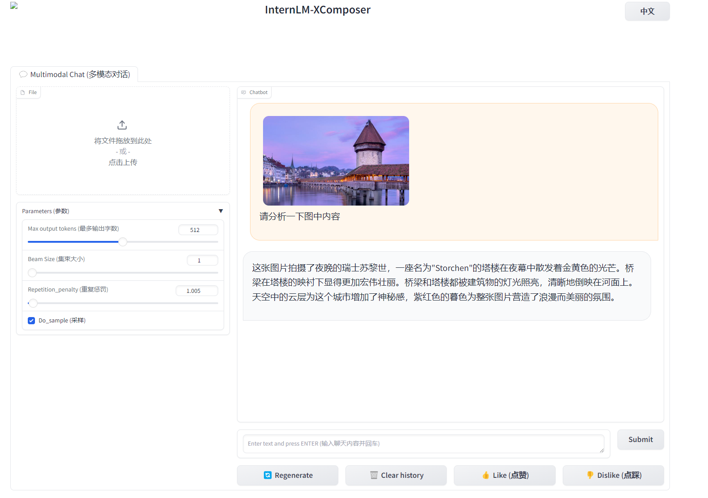
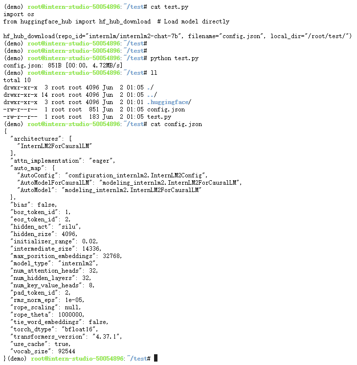

# 使用 InternLM2-Chat-1.8B 模型生成 300 字的小故事



# Lagent 工具调用 数据分析 Demo 部署



# 浦语·灵笔2 的 图文创作 及 视觉问答 部署
## 图文创作



## 视觉问答



# 熟悉 huggingface 下载功能，使用 huggingface_hub python 包，下载 InternLM2-Chat-7B 的 config.json 文件到本地
## 安装依赖
```shell
pip install -U huggingface_hub
```

## 下载 InternLM2-Chat-7B 的 config.json 文件
