# RAG
## 定义
> RAG (Retrieval Augmented Generation) 是一种结合了检索（Retrieval）和生成（Generation）的技术，旨在通过利用外部知识库来增强大型语言模型（LLMs）的性能。
> 它通过检索与用户输入相关的信息片段，并结合这些信息来生成更准确、更丰富的回答。
> 

可以理解为一个搜索引擎，用户输入作为索引，在外部知识库中检索相关内容，结合大语言模型的能力生成回答。

## 解决的挑战
1. 生成幻觉
2. 过时知识
3. 缺乏透明和可追溯的推理过程
4. 可以实现外部记忆
5. 因为没有训练的过程，成本低

## 应用场景
1. 问答系统
2. 文本生成
3. 信息检索
4. 图片描述

## 工作原理
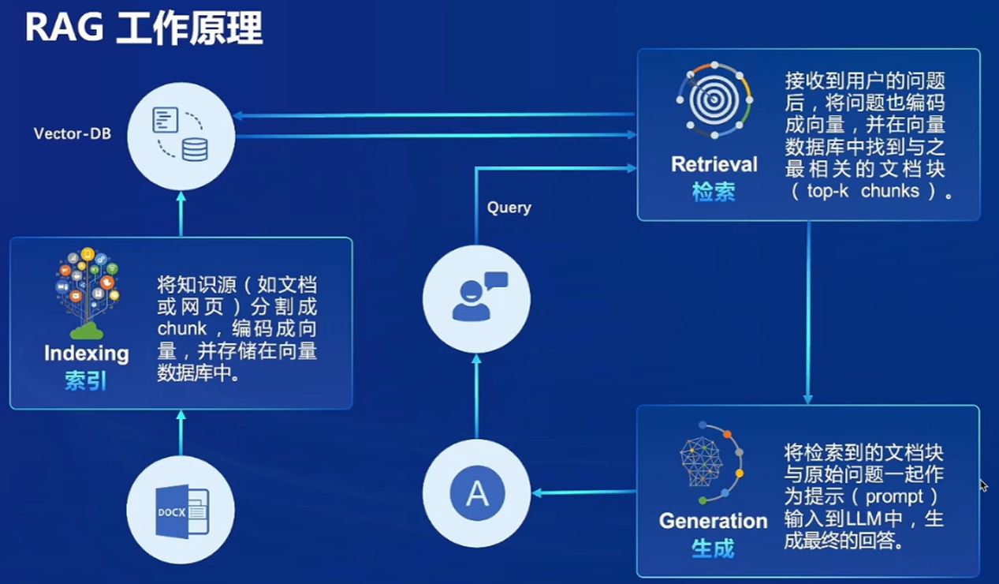

### 重要组成部分
1. 向量数据库（Vector-DB）
2. 索引（Indexing）
3. 检索（Retrieval）
4. 生成（Generation）

## 示例流程
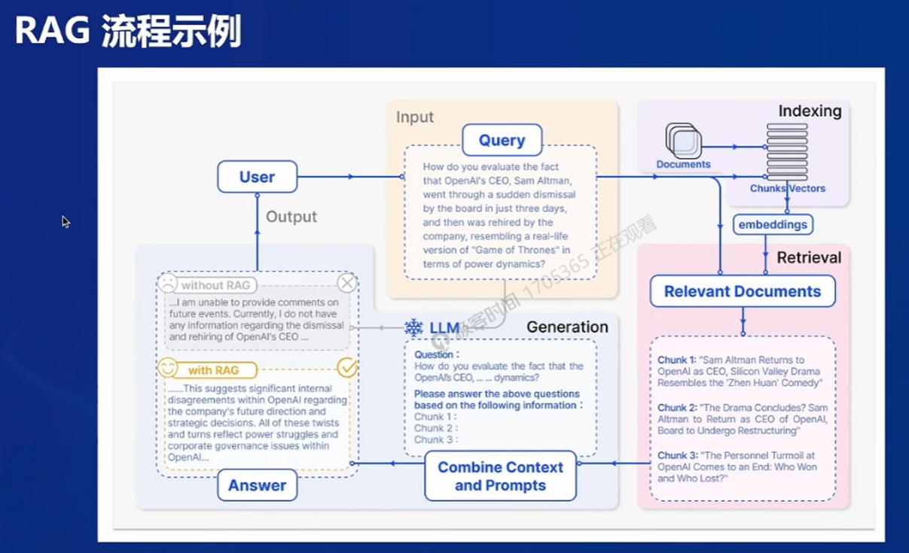

## RAG 三种范式
1. Naive RAG：问答系统、信息检索
2. Advanced RAG：摘要生成、内容推荐
3. Modular RAG：多模态任务、对话系统

## 常见优化方法
1. 嵌入优化（Embedding Optimization）
   1. 结合稀疏和密集检索
   2. 多任务
2. 索引优化（Indexing Optimization）
   1. 细粒度分割（Chuck）
   2. 元数据
3. 查询优化（Query Optimization）
   1. 查询扩展、转换
   2. 多查询
4. 上下文管理（Context Curation）
   1. 重排（rerank）
   2. 上下文选择/压缩
5. 迭代检索（Iterative Retrieval）
   1. 根据初始查询和迄今为止的生成文本进行重复搜索
6. 递归检索（Recursive Retrieval）
   1. 迭代细化搜索查询
   2. 链式推理（Chain-of-Through）指导检索过程
7. 自适应检索（Adaptive Retrieval）
   1. Flare，Self-RAG
   2. 使用 LLMs 主动决定检索的最佳时机和内容
8. LLM 微调（LLM Fine-tuning）
   1. 检索微调
   2. 生成微调
   3. 双重微调

## RAG vs 微调（Fine-tuning）

## LLM 模型优化方法比较
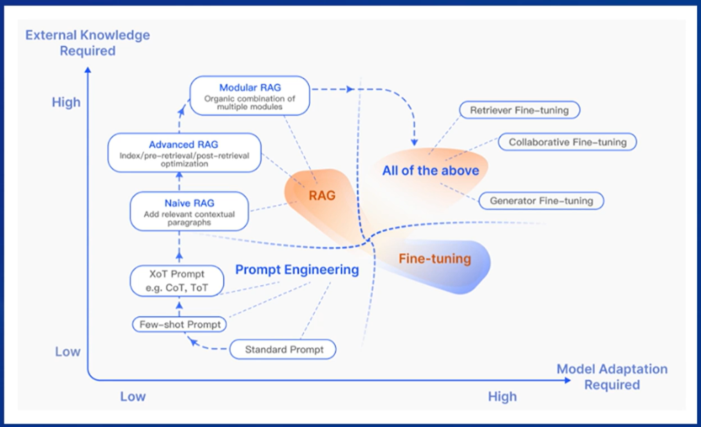

## 评估框架和基准测试
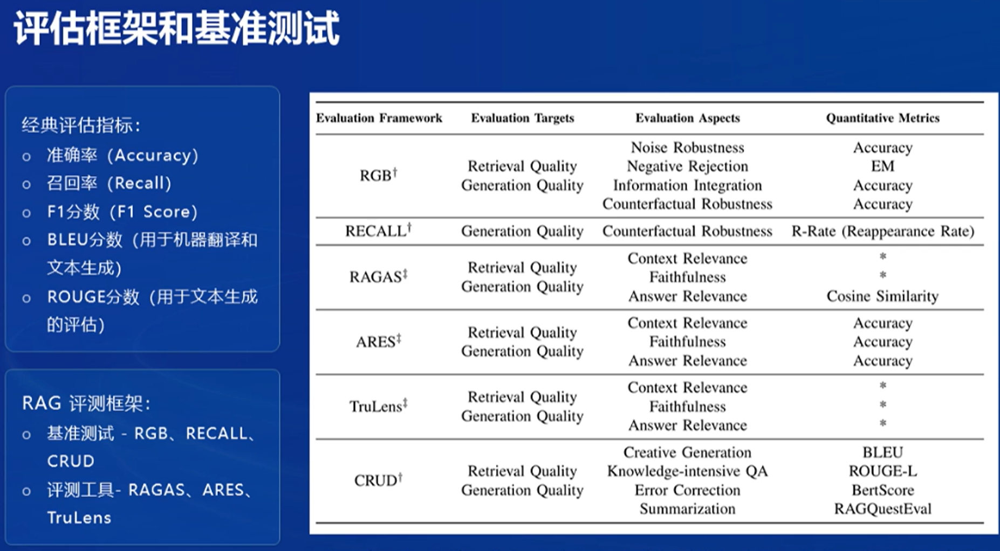

# 茴香豆
## 介绍
    是一个基于 LLMs 的领域知识助手，由书生浦语团队开发的开源大模型应用

## 应用场景
1. 智能客服：技术支持、领域知识对话
2. IM 工具中创建用户群组，讨论，解答相关的问题
3. 随着用户数量的增加，答复内容高度重复，充斥大量无意义和闲聊，人工回复，成本高，影响工作效率
4. 通过提供自动化的问题支持，帮助维护者减轻负担，同时确保用户问题得到有效解答

## 场景难点
1. 群聊中的信息量巨大，且内容多样，从技术讨论到闲聊应有尽有
2. 用户问题通常一个人紧密相关，需要准确的实时的专业知识解答
3. 传统的 NLP 解决方案无法准确解析用户意图，却往往无法提供满意的答案
4. 需要一个能够在群聊中准确识别与回答相关问题的智能助手，同时避免造成信息过载

## 核心特性
1. 开源免费： BSD-3-Clasue 免费商用
2. 高效准确： Hybrid LLMs 转为群聊优化
3. 领域知识： 应用 RAG 技术专业知识快速获取
4. 部署成本低： 无需额外训练，可利用云端模型 api ，本地算力需求少
5. 安全： 可完全本地部署，信息不上传，保护数据和用户隐私
6. 扩展性强： 兼容多种 IM 软件，支持多种开源 LLMs 和云端 api

## 构建
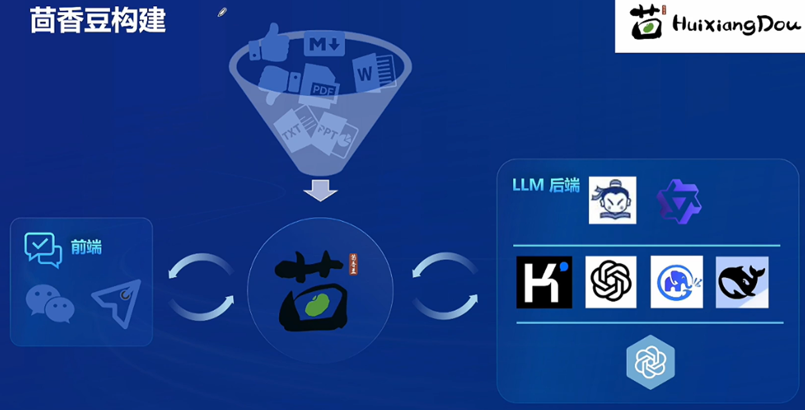

## 工作流
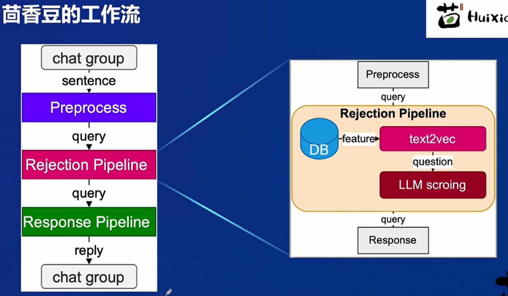

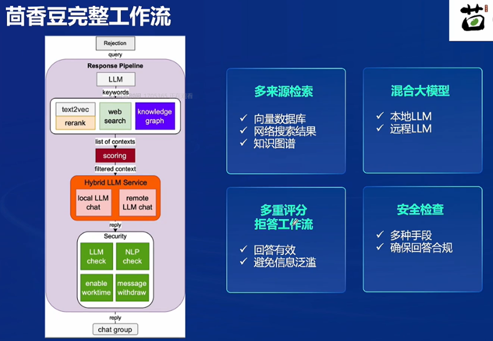

# 线上茴香豆助手对话
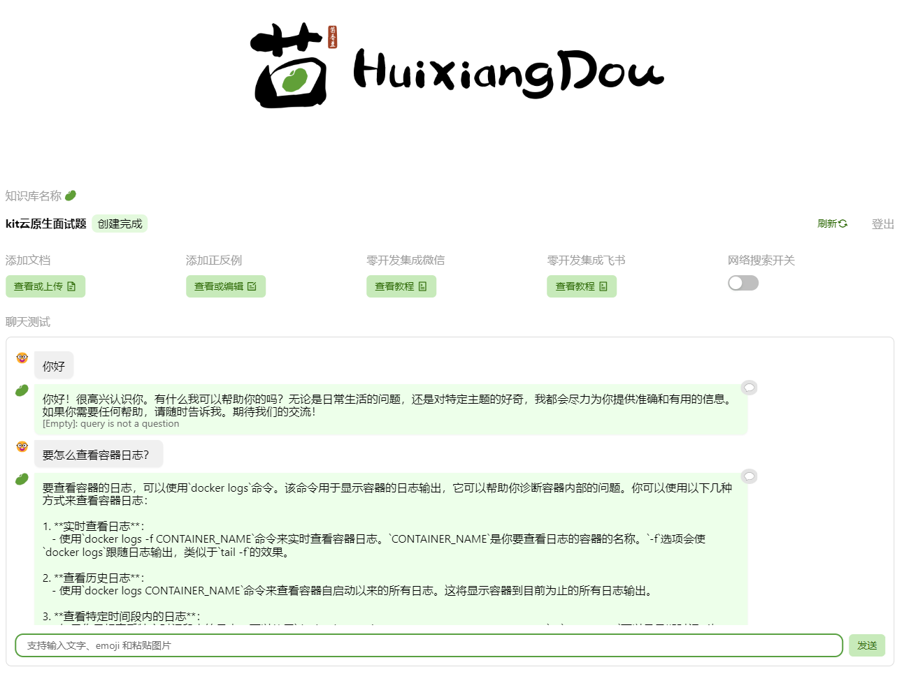

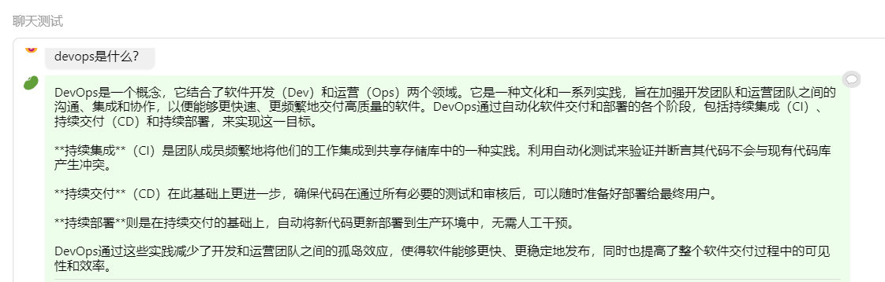

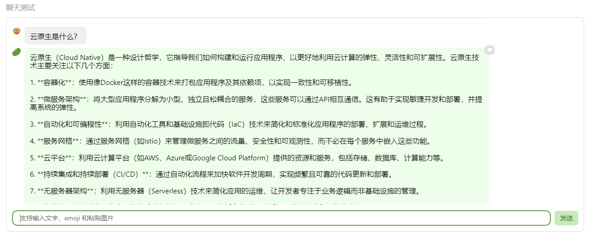

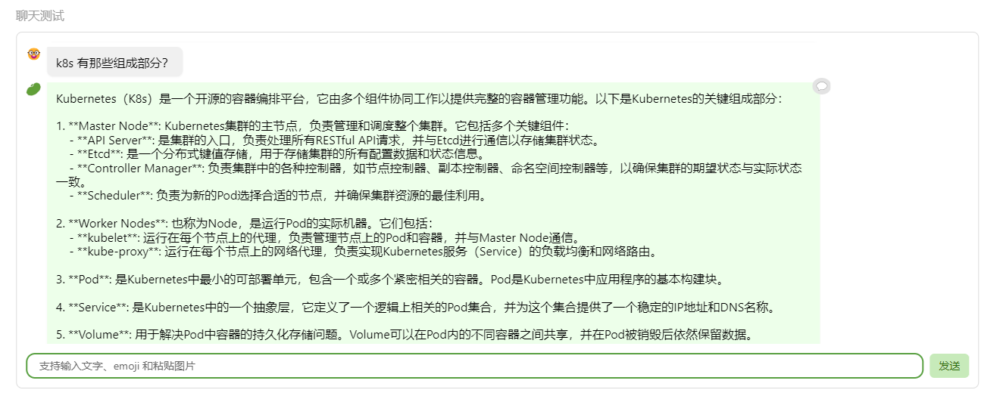

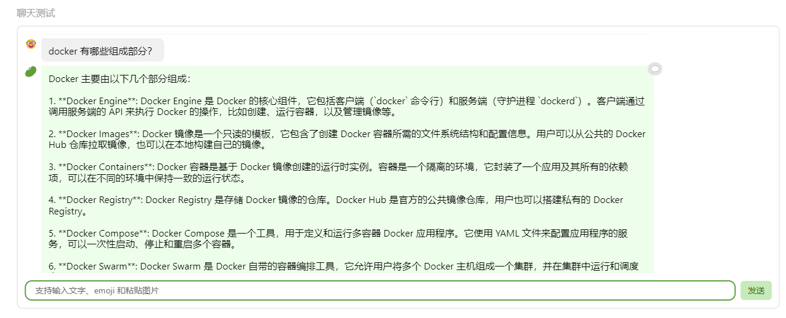

# 在 InternLM Studio 上部署茴香豆技术助手
## 根据教程文档搭建 茴香豆技术助手，针对问题"茴香豆怎么部署到微信群？"进行提问

在部署过程中需要额外安装依赖和对配置文件进行检查
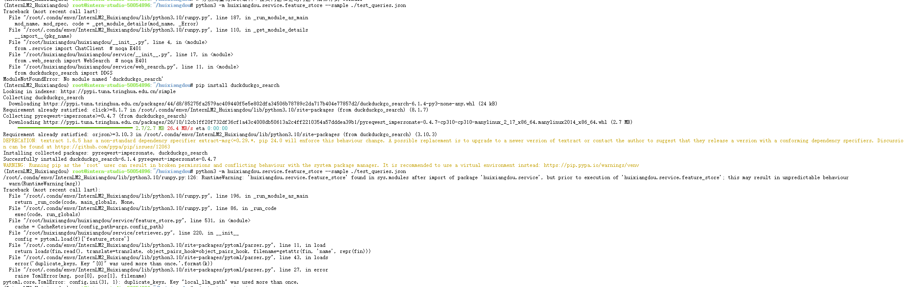

