# 使用Transformer库运行模型
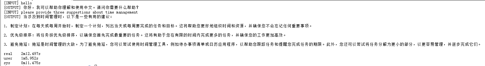

# 使用LMDeploy与模型对话
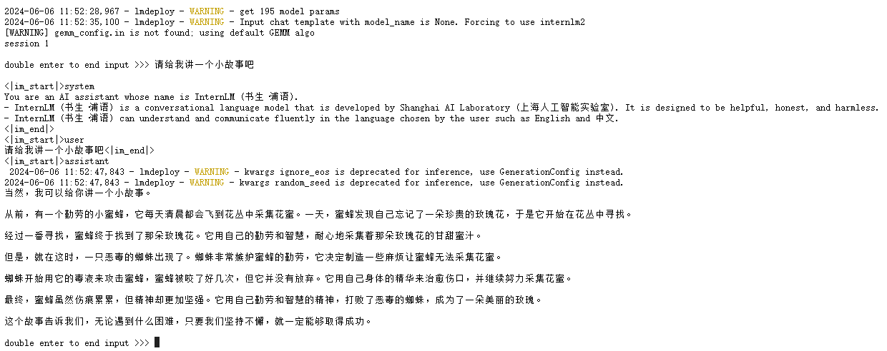

# LMDeploy模型量化(lite)
## 设置最大KV Cache缓存大小
### 不加 --cache-max-entry-count 参数
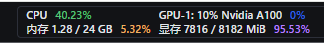

### 加 --cache-max-entry-count 0.5 参数
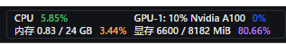

### 加 --cache-max-entry-count 0.01 参数
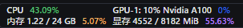

## 使用W4A16量化
### 不加 --cache-max-entry-count 参数
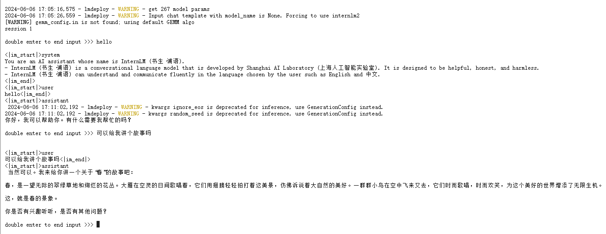

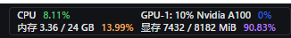

### 加 --cache-max-entry-count 0.01 参数
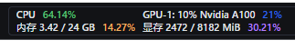

# LMDeploy服务(serve)
## 启动API服务器
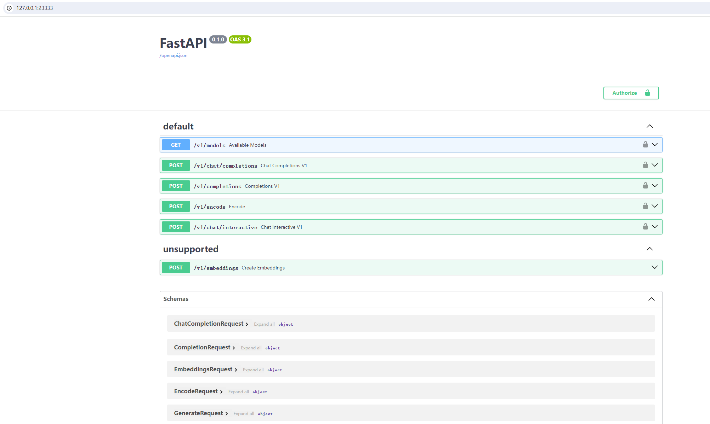

## 命令行客户端连接API服务器
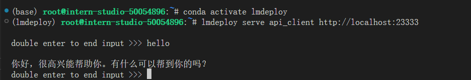

## 网页客户端连接API服务器
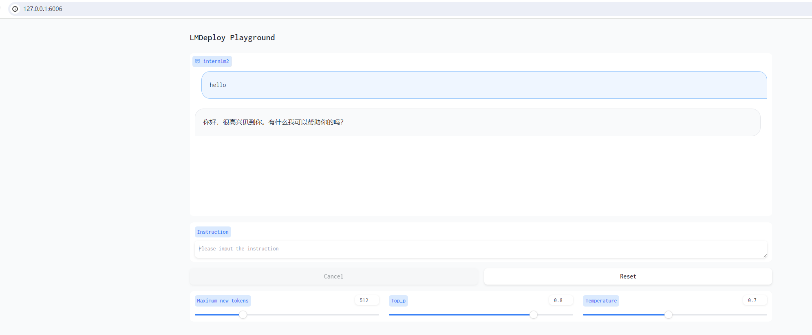

# Python代码集成
## Python代码集成运行1.8B模型
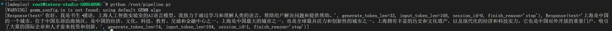

## 向TurboMind后端传递参数
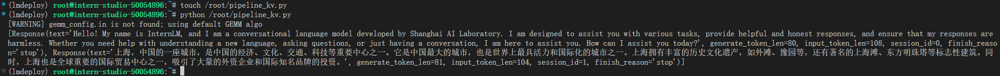

# 拓展部分
## 使用LMDeploy运行视觉多模态大模型llava
### 使用pipeline推理 llava-v1.6-7b

### 通过 Gradio 来运行 llava 模型
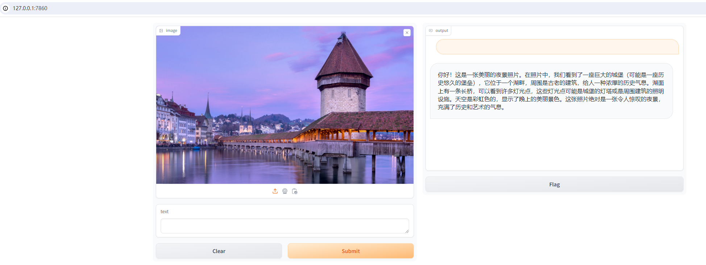

## 定量比较LMDeploy与Transformer库的推理速度差异
### Transformer 库推理 Internlm2-chat-1.8b
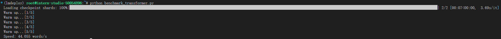

### LMDeploy的推理速度
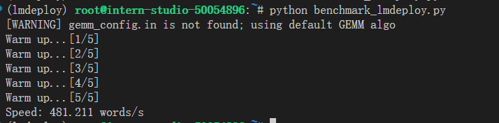

